# Design — Caderno de Plantão MVP

## 1. Resumo

Este documento descreve o design técnico completo do MVP web do **Caderno de Plantão**, implementando exclusivamente o Caso 01 — "As Balas" com Jéssica como personagem jogável. O sistema é uma aplicação web estática (SPA) hospedada no GitHub Pages, offline-capable após primeiro carregamento, sem backend, sem autenticação e sem IA generativa em runtime.

A arquitetura segue 7 camadas com dependências unidirecionais: Domain/Contracts → Content → Narrative Engine → Interface → Persistence → Validation → Application Composition. O motor narrativo é content-agnostic — interpreta qualquer arquivo de caso válido sem alteração de código. A experiência preserva o tom de light novel clínica: ambiguidade, consequências tardias, estados invisíveis e debriefing causal pedagógico.

---

## 2. Objetivos e Não Objetivos

### Objetivos

- Implementar motor narrativo genérico que executa grafos direcionados de nós narrativos
- Executar o Caso 01 completo: 4 cenas de decisão, nós de progressão, 4 desfechos, debriefing causal
- Garantir operação offline após primeiro carregamento
- Persistir sessão localmente com restauração segura
- Validar arquivos de caso com 22 critérios estruturais antes da execução
- Atender WCAG 2.1 AA em navegação, contraste, foco e leitores de tela
- Manter tom narrativo imersivo sem expor mecânicas internas ao jogador
- Hospedar como site estático no GitHub Pages sem dependência de servidor

### Não Objetivos

- Catálogo ou navegação entre múltiplos casos
- Autenticação, perfis de usuário ou backend
- Sincronização em nuvem ou compartilhamento de progresso
- Geração de conteúdo por IA em runtime
- Migração de saves entre versões do schema
- Analytics, telemetria ou coleta de dados
- Componentes sociais ou competitivos
- Internacionalização (MVP apenas em português brasileiro)
- Suporte a múltiplas sessões simultâneas do mesmo caso

---

## 3. Arquitetura em 7 Camadas

### 3.1 Definição das Camadas

| Camada | Responsabilidade | Depende de |
|--------|-----------------|------------|
| **Domain / Contracts** | Tipos, interfaces e contratos neutros compartilhados | Nada |
| **Content** | Dados declarativos do caso (JSON) | Nada (dados puros) |
| **Narrative Engine** | Interpretação do grafo, avaliação de condições, aplicação de efeitos, resolução de desfechos | Domain + contratos abstratos de persistência |
| **Interface (UI)** | Apresentação narrativa, interação, acessibilidade | Domain + API pública da Engine |
| **Persistence** | Implementação concreta de armazenamento (localStorage) | Domain |
| **Validation / Tooling** | Validação estrutural de arquivos de caso, CLI | Domain + Content schema |
| **Application Composition** | Wiring de dependências, bootstrap, Service Worker | Todas (ponto de composição) |

### 3.2 Regras de Dependência

1. **Domain** não depende de nenhuma outra camada
2. **Content** contém apenas dados declarativos — nenhum código executável
3. **Engine** depende apenas de Domain e de contratos abstratos de persistência (interface `SessionRepository`)
4. **UI** depende de Domain e da API pública da Engine — não computa regras de jogo
5. **Persistence** depende apenas de Domain — não interpreta estados clínicos
6. **Validation** depende de Domain e do schema de conteúdo — não executa partidas
7. **Application Composition** é o único ponto que instancia implementações concretas
8. Nenhuma dependência circular é permitida
9. UI nunca altera estados diretamente
10. Persistence nunca interpreta significado clínico dos dados

### 3.3 Diagrama de Arquitetura

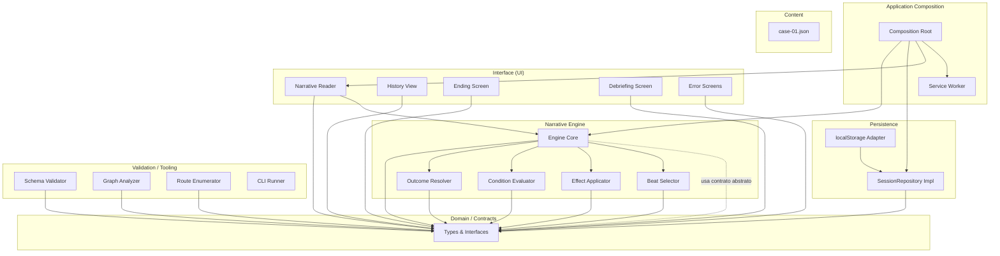

### 3.4 Diagrama de Dependências

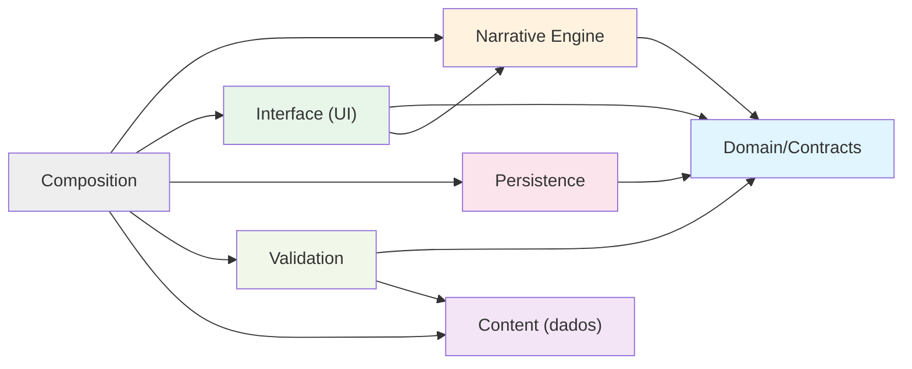

---

## 4. Domain / Contracts

Camada neutra de tipos compartilhados. Nenhuma implementação, apenas definições. Nenhum destes contratos depende de navegador, DOM, framework de UI ou mecanismo concreto de armazenamento.

### 4.1 Tipos Principais

```typescript
// === Metadados (sem duplicação de campos de topo) ===
interface CaseMetadata {
  title: string;
  subtitle?: string;
  playableCharacterId: string;
  synopsis?: string;
  locale: 'pt-BR';
}

// === Arquivo de Caso ===
interface CaseFile {
  schemaVersion: string;
  caseId: string;
  caseVersion: string;
  metadata: CaseMetadata;
  startNodeId: string;
  states: StateDefinition[];
  nodes: NarrativeNode[];
  endings: EndingDefinition[];
  debriefings: DebriefingDefinition[];
  debriefingFragments: DebriefingFragment[];
  interpersonalBeats: InterpersonalBeat[];
  warnings?: string[];
  editorialReferences?: string[];
  provisionalContent?: string[];
  editorialReviewStatus: 'draft' | 'reviewed' | 'approved';
  clinicalReviewStatus: 'pending' | 'reviewed' | 'approved';
}

// === Definição de Estado ===
type StateType = 'integer' | 'boolean' | 'enum' | 'nullable_boolean';

interface StateDefinition {
  name: string;
  type: StateType;
  initialValue: number | boolean | string | null;
  minimum?: number;        // obrigatório para integer
  maximum?: number;        // obrigatório para integer
  enumValues?: string[];   // obrigatório para enum
}
```

**Nota sobre metadados**: `schemaVersion`, `caseId` e `caseVersion` existem exclusivamente no nível de topo do `CaseFile`. Não são duplicados dentro de `CaseMetadata`.

### 4.2 Nós Narrativos — Discriminated Union

```typescript
// === Nós Narrativos (discriminated union por 'kind') ===
type NarrativeNode =
  | DecisionNode
  | ProgressionNode
  | OutcomeResolutionNode
  | EndingNode
  | DebriefingNode;

// === Metadados de apresentação dos nós ===
interface RequiredTitlePresentationMetadata {
  title: string;              // obrigatório — não pode ser vazio
  narrativeTime?: string;
}

interface OptionalTitlePresentationMetadata {
  title?: string;
  narrativeTime?: string;
}

// Alias para uso genérico
type NarrativePresentationMetadata = RequiredTitlePresentationMetadata | OptionalTitlePresentationMetadata;

interface DecisionNode {
  kind: 'decision';
  id: string;
  prose: string;
  presentationMetadata: RequiredTitlePresentationMetadata;
  choices: ChoiceDefinition[];
  interpersonalBeatIds: string[];  // referências aos beats deste nó
}

interface ProgressionNode {
  kind: 'progression';
  id: string;
  prose: string;
  presentationMetadata: OptionalTitlePresentationMetadata;
  continuationAction: ContinuationAction;
  transition: TransitionDefinition;
}

// Nó interno — NÃO apresentado ao jogador.
// Não possui presentationMetadata porque nunca é renderizado nem aparece no histórico.
// Dispara o OutcomeResolver e redireciona para o EndingNode correto.
interface OutcomeResolutionNode {
  kind: 'outcome_resolution';
  id: string;
}

// Referência a EndingDefinition — conteúdo NÃO é inline.
// Possui continuationAction para o jogador avançar explicitamente ao debriefing.
interface EndingNode {
  kind: 'ending';
  id: string;
  endingId: string;      // referência ao EndingDefinition em endings[]
  presentationMetadata: RequiredTitlePresentationMetadata;
  continuationAction: ContinuationAction;  // ex: "Ver debriefing"
  nextNodeId: string;    // aponta para o DebriefingNode correspondente
}

// Referência a DebriefingDefinition — conteúdo NÃO é inline.
interface DebriefingNode {
  kind: 'debriefing';
  id: string;
  debriefingId: string;  // referência ao DebriefingDefinition em debriefings[]
  presentationMetadata: RequiredTitlePresentationMetadata;
}
```

**Justificativa da discriminated union**: O campo `kind` permite narrowing de tipo em compile-time. Cada variante expõe apenas os campos relevantes. A Engine faz dispatch por `kind` sem casts inseguros.

**Fluxo obrigatório no final do caso**: Cena 4 → nó de consequência (progressão) → `OutcomeResolutionNode` → OutcomeResolver → `EndingNode` → `DebriefingNode`.

O `OutcomeResolutionNode` é um nó lógico interno que não renderiza prosa. A Engine intercepta esse nó, executa o resolvedor de desfechos e redireciona para o `EndingNode` correspondente.

### 4.3 Transições Autocontidas

```typescript
// === Transição (pertence à escolha ou ao nó de progressão) ===
type TransitionDefinition =
  | { kind: 'direct'; targetNodeId: string }
  | { kind: 'conditional'; branches: ConditionalBranch[]; fallbackNodeId: string };

interface ConditionalBranch {
  condition: ConditionExpression;
  targetNodeId: string;
  priority: number;  // menor = avaliado primeiro
}
```

A transição é **autocontida**: pertence à escolha (em `DecisionNode`) ou ao nó (em `ProgressionNode`). Não existe mais `conditionalTransitions` nem `defaultNextNodeId` separados no nó.

**Ordem de avaliação**: escolha → efeitos → validação do estado → avaliação da transição → destino.

### 4.4 Escolhas e Ações de Continuidade

```typescript
// === Escolha (aparece apenas em DecisionNode) ===
interface ChoiceDefinition {
  id: string;
  label: string;             // texto apresentado ao jogador
  accessibleLabel?: string;  // label para AT se diferente
  effects: StateEffect[];
  transition: TransitionDefinition;  // destino autocontido
}

// === Ação de Continuidade (aparece em ProgressionNode e EndingNode) ===
interface ContinuationAction {
  label: string;             // "Continuar" ou "Ver debriefing"
  accessibleLabel?: string;
  // SEM effects — por definição não altera estados
  // Destino: em ProgressionNode usa node.transition; em EndingNode usa node.nextNodeId
}
```

**Diferença formal Choice vs ContinuationAction**:

| Aspecto | ChoiceDefinition | ContinuationAction |
|---------|------------------|--------------------|
| Identificador | Sim (`id`) | Não |
| Aplica efeitos | Sim (`effects`) | Nunca |
| Participa do histórico decisório | Sim | Não |
| Aparece no debriefing | Sim | Nunca |
| Afeta transições/desfechos | Sim | Nunca |
| Define transição | Sim (`transition`) | Não (usa `ProgressionNode.transition` ou `EndingNode.nextNodeId`) |
| Presente em | DecisionNode | ProgressionNode, EndingNode |

### 4.5 Efeitos e Condições

```typescript
// === Efeitos ===
type EffectOperation = 'set' | 'increment' | 'decrement';

interface StateEffect {
  target: string;           // nome do estado
  operation: EffectOperation;
  value?: number | boolean | string | null;  // obrigatório para 'set'
  amount?: number;          // obrigatório para increment/decrement; DEVE ser > 0
}
```

**Regra de amount**: `increment.amount` e `decrement.amount` devem ser números positivos (> 0). O schema e o validador rejeitam `amount <= 0`. Para reduzir um estado, use `decrement` com amount positivo em vez de `increment` com amount negativo.

```typescript
// === Expressões de Condição ===
type ConditionExpression =
  | { op: 'eq'; state: string; value: number | boolean | string | null }
  | { op: 'neq'; state: string; value: number | boolean | string | null }
  | { op: 'gt'; state: string; value: number }
  | { op: 'gte'; state: string; value: number }
  | { op: 'lt'; state: string; value: number }
  | { op: 'lte'; state: string; value: number }
  | { op: 'isNull'; state: string }
  | { op: 'isNotNull'; state: string }
  | { op: 'and'; conditions: ConditionExpression[] }
  | { op: 'or'; conditions: ConditionExpression[] }
  | { op: 'not'; condition: ConditionExpression };
```

### 4.6 Desfechos e Debriefing

```typescript
// === Desfecho ===
type EndingName = 'tragico' | 'grave' | 'excelente' | 'bom';

interface EndingDefinition {
  id: string;
  name: EndingName;
  evaluationOrder: 1 | 2 | 3 | 4;   // tragico=1, grave=2, excelente=3, bom=4
  condition: ConditionExpression;
  prose: string;
}

// === Debriefing — Composto por fragmentos condicionais ===
interface DebriefingDefinition {
  id: string;
  endingId: string;
  outcomeFragmentId: string;     // fragmento fixo do desfecho
  fragmentIds: string[];          // fragmentos condicionais disponíveis
  closingFragmentId: string;      // fragmento de encerramento
}

interface DebriefingFragment {
  id: string;
  section:
    | 'desfecho'
    | 'percepcao'
    | 'risco'
    | 'protecao'
    | 'aprendizado'
    | 'revisao_clinica';
  condition?: ConditionExpression;      // se ausente, sempre incluído
  sourceChoiceIds?: string[];           // escolhas de origem (rastreabilidade)
  analysisCategory?: AnalysisCategory;
  priority: number;                      // menor = maior precedência dentro da seção
  content: string;
}

type AnalysisCategory =
  | 'decisao_adequada'
  | 'decisao_defensavel_incompleta'
  | 'processo_inseguro_sem_dano'
  | 'atraso'
  | 'omissao'
  | 'fator_protetor'
  | 'fator_sistemico'
  | 'decisao_critica';
```

**Composição do debriefing**: A Engine monta o debriefing deterministicamente com base em `endingId`, `confirmedChoices`, estados finais, condições dos fragmentos e prioridade. Dois jogadores que chegam ao mesmo desfecho por caminhos diferentes receberão debriefings diferentes. Nenhuma IA generativa é utilizada.

### 4.7 Beats Interpessoais

```typescript
interface InterpersonalBeat {
  id: string;
  sourceNodeId: string;          // nó de decisão de origem
  sourceChoiceIds?: string[];    // se presente, restringe ativação a essas escolhas; se ausente, qualquer escolha do sourceNodeId
  band: 'negative' | 'neutral' | 'positive';  // confianca <= -1, = 0, >= 1
  bandCondition: ConditionExpression;
  timing: 'immediate' | 'deferred';
  prose: string;
  // Para beats diferidos:
  deferredActivationCondition?: ConditionExpression;
  eligibleNodeId?: string;        // nó onde o beat pode aparecer
}
```

**Validação de beats**:
- Em desenvolvimento (caso draft): beat ausente para alguma faixa gera **warning editorial**
- Em build de produção: beat ausente para qualquer faixa gera **erro bloqueante**
- Em runtime de produção: ausência inesperada gera **ContentRuntimeError**

### 4.8 Sessão e Persistência

```typescript
// === Snapshot de Sessão Ativa ===
interface ActiveSessionSnapshot {
  schemaVersion: string;
  caseId: string;
  caseVersion: string;
  sessionId: string;
  currentNodeId: string;
  states: Record<string, number | boolean | string | null>;
  confirmedChoices: ConfirmedChoice[];
  visitedNodes: string[];
  sessionStatus: 'in_progress' | 'completed';
  updatedAt: string;  // ISO 8601
}

interface ConfirmedChoice {
  sequence: number;        // fonte primária de ordenação (incremental)
  nodeId: string;
  choiceId: string;
  confirmedAt: string;     // timestamp auxiliar (ISO 8601)
}

// === Registro de Última Conclusão (resumido, sem estados finais) ===
interface LastCompletionRecord {
  schemaVersion: string;
  caseId: string;
  caseVersion: string;
  endingId: string;
  completedAt: string;     // ISO 8601
}

// === Contrato abstrato de repositório ===
interface SessionRepository {
  saveActiveSession(snapshot: ActiveSessionSnapshot): Promise<void>;
  loadActiveSession(caseId: string): Promise<ActiveSessionSnapshot | null>;
  deleteActiveSession(caseId: string): Promise<void>;
  saveLastCompletion(record: LastCompletionRecord): Promise<void>;
  loadLastCompletion(caseId: string): Promise<LastCompletionRecord | null>;
  deleteLastCompletion(caseId: string): Promise<void>;
  isAvailable(): boolean;
}
```

### 4.9 API Pública da Engine (Assíncrona)

```typescript
// === Listener e Unsubscribe ===
type EngineEventListener = (event: EngineEvent) => void;
type Unsubscribe = () => void;

// === API Pública ===
interface NarrativeEngine {
  startCase(caseFile: CaseFile): Promise<void>;
  restoreSession(snapshot: ActiveSessionSnapshot, caseFile: CaseFile): Promise<void>;
  confirmChoice(nodeId: string, choiceId: string): Promise<void>;
  continueNarrative(nodeId: string): Promise<void>;
  restartCase(): Promise<void>;
  getHistoryPresentation(): HistoryPresentation;    // síncrono, leitura
  getCurrentPresentation(): NodePresentation;          // síncrono, leitura
  subscribe(listener: EngineEventListener): Unsubscribe;
  dispose(): void;
}
```

**Regras da API assíncrona**:
- Comandos mutáveis são **enfileirados** — somente um é processado por vez
- Cada método `Promise<void>` resolve quando o processamento lógico termina
- Eventos são emitidos via `subscribe` durante a operação
- Erros esperados são convertidos em eventos (`CONTENT_ERROR`, `PERSISTENCE_WARNING`)
- Métodos de leitura (`getHistoryPresentation`, `getCurrentPresentation`) são síncronos e não entram na fila

### 4.10 Eventos da Engine

```typescript
type EngineEvent =
  | { type: 'CASE_STARTED'; presentation: NodePresentation }
  | { type: 'NODE_PRESENTED'; presentation: NodePresentation }
  | { type: 'CHOICE_CONFIRMATION_STARTED'; nodeId: string; choiceId: string }
  | { type: 'CHOICE_CONFIRMED'; presentation: NodePresentation; beat?: BeatPresentation }
  | { type: 'CONTINUATION_COMPLETED'; presentation?: NodePresentation; beat?: BeatPresentation }
  | { type: 'SESSION_RESTORED'; presentation: NodePresentation }
  | { type: 'ENDING_RESOLVED'; ending: EndingPresentation }
  | { type: 'DEBRIEFING_PRESENTED'; debriefing: DebriefingPresentation }
  | { type: 'PERSISTENCE_WARNING'; message: string }
  | { type: 'CONTENT_ERROR'; error: ContentError }
  | { type: 'SESSION_INVALIDATED'; reason: string };

// === Apresentação (dados seguros para UI — sem estados internos) ===
interface NodePresentation {
  nodeId: string;
  prose: string;
  presentationMetadata: NarrativePresentationMetadata;
  options?: OptionPresentation[];
  nodeKind: 'decision' | 'progression' | 'ending' | 'debriefing';
}

interface OptionPresentation {
  id: string;
  label: string;
  accessibleLabel?: string;
  isContinuation: boolean;
}

interface BeatPresentation {
  prose: string;
}

interface EndingPresentation {
  endingName: EndingName;
}
```

> **Nota**: A prosa do desfecho é renderizada exclusivamente via `NodePresentation` do `EndingNode` (no evento `CONTINUATION_COMPLETED`). `ENDING_RESOLVED` é complementar — transporta apenas `endingName` sem provocar nova renderização.

interface DebriefingPresentation {
  sections: { title: string; entries: DebriefingEntryPresentation[] }[];
}

interface DebriefingEntryPresentation {
  content: string;
  analysisCategory?: string;
}
```

### 4.11 Estado Técnico Interno da Engine

```typescript
// Estado técnico interno — NÃO faz parte do CaseFile nem é estado clínico.
interface EngineInternalState {
  persistenceStatus: 'available' | 'degraded';
  commandQueueLength: number;
  isProcessing: boolean;
}
```

### 4.12 Validação

```typescript
interface ContentValidationResult {
  isValid: boolean;
  errors: ContentValidationError[];
  warnings: ContentValidationWarning[];
}

interface ContentValidationError {
  code: string;
  severity: 'blocking';
  location: string;        // path no JSON (ex: "nodes[3].choices[1]")
  message: string;
  category: 'structural' | 'graph' | 'domain' | 'coverage';
}

interface ContentValidationWarning {
  code: string;
  severity: 'editorial' | 'clinical' | 'quality';
  location: string;
  message: string;
}
```


---

## 5. Modelo do Arquivo de Caso

O arquivo de caso é um documento JSON declarativo, legível por humanos, versionável em git. Contém toda a definição lógica e narrativa necessária para execução de uma partida.

### 5.1 Estrutura de Topo

```json
{
  "schemaVersion": "1.0.0",
  "caseId": "caso-01-as-balas",
  "caseVersion": "1.0.0",
  "metadata": {
    "title": "As Balas",
    "playableCharacterId": "jessica-almeida",
    "locale": "pt-BR"
  },
  "startNodeId": "cena-1-inicio",
  "states": [ /* StateDefinition[] */ ],
  "nodes": [ /* NarrativeNode[] */ ],
  "endings": [ /* EndingDefinition[] */ ],
  "debriefings": [ /* DebriefingDefinition[] */ ],
  "debriefingFragments": [ /* DebriefingFragment[] */ ],
  "interpersonalBeats": [ /* InterpersonalBeat[] */ ],
  "warnings": [],
  "editorialReferences": ["Rotas_As_Balas.md", "Modelo_Tom_escrita.md"],
  "provisionalContent": [],
  "editorialReviewStatus": "draft",
  "clinicalReviewStatus": "pending"
}
```

### 5.2 Declaração de Estados — Caso 01

```json
{
  "states": [
    {
      "name": "tempo_atrasado",
      "type": "integer",
      "initialValue": 0,
      "minimum": 0,
      "maximum": 3
    },
    {
      "name": "voltaren_comunicado",
      "type": "boolean",
      "initialValue": false
    },
    {
      "name": "processo_heparina_seguro",
      "type": "boolean",
      "initialValue": false
    },
    {
      "name": "vigilancia_ativa",
      "type": "integer",
      "initialValue": 0,
      "minimum": 0,
      "maximum": 2
    },
    {
      "name": "confianca_equipe",
      "type": "integer",
      "initialValue": 0,
      "minimum": -2,
      "maximum": 2
    },
    {
      "name": "acao_critica_a_tempo",
      "type": "nullable_boolean",
      "initialValue": null
    }
  ]
}
```

### 5.3 Exemplo Estrutural de Nó de Decisão (Cena 1)

```json
{
  "kind": "decision",
  "id": "cena-1-ecg-quente",
  "prose": "O ECG sai da impressora com um estalo seco...",
  "presentationMetadata": {
    "title": "O ECG quente",
    "narrativeTime": "23h40"
  },
  "choices": [
    {
      "id": "1a-interromper-medico",
      "label": "Interromper o médico diretamente",
      "effects": [
        { "target": "tempo_atrasado", "operation": "set", "value": 0 },
        { "target": "confianca_equipe", "operation": "decrement", "amount": 1 }
      ],
      "transition": { "kind": "direct", "targetNodeId": "cena-1-pos-1a" }
    },
    {
      "id": "1b-levar-enfermeira",
      "label": "Levar o ECG à enfermeira",
      "effects": [
        { "target": "tempo_atrasado", "operation": "increment", "amount": 1 },
        { "target": "confianca_equipe", "operation": "set", "value": 0 }
      ],
      "transition": { "kind": "direct", "targetNodeId": "cena-1-pos-1b" }
    },
    {
      "id": "1c-guardar-prontuario",
      "label": "Guardar no prontuário",
      "effects": [
        { "target": "tempo_atrasado", "operation": "increment", "amount": 2 },
        { "target": "confianca_equipe", "operation": "decrement", "amount": 1 }
      ],
      "transition": { "kind": "direct", "targetNodeId": "cena-1-pos-1c" }
    },
    {
      "id": "1d-repetir-ecg",
      "label": "Repetir o ECG",
      "effects": [
        { "target": "tempo_atrasado", "operation": "increment", "amount": 1 },
        { "target": "confianca_equipe", "operation": "set", "value": 0 }
      ],
      "transition": { "kind": "direct", "targetNodeId": "cena-1-pos-1d" }
    }
  ],
  "interpersonalBeatIds": ["beat-cena1-neg", "beat-cena1-neutro", "beat-cena1-pos"]
}
```

### 5.4 Exemplo de Nó de Progressão

```json
{
  "kind": "progression",
  "id": "cena-1-pos-1a",
  "prose": "Eu entro na sala. Minha voz sai mais alta do que eu queria...",
  "presentationMetadata": {
    "title": "Interrupção"
  },
  "continuationAction": {
    "label": "Continuar",
    "accessibleLabel": "Avançar para a próxima cena"
  },
  "transition": { "kind": "direct", "targetNodeId": "cena-2-inicio" }
}
```

### 5.5 Exemplo Estrutural de EndingNode

```json
{
  "kind": "ending",
  "id": "ending-node-tragico",
  "endingId": "ending-tragico",
  "presentationMetadata": {
    "title": "O monitor silencia"
  },
  "continuationAction": {
    "label": "Ver debriefing",
    "accessibleLabel": "Avançar para a análise do seu plantão"
  },
  "nextNodeId": "debriefing-node-tragico"
}
```

### 5.6 Declaração de Desfechos

```json
{
  "endings": [
    {
      "id": "ending-tragico",
      "name": "tragico",
      "evaluationOrder": 1,
      "condition": {
        "op": "and",
        "conditions": [
          { "op": "eq", "state": "acao_critica_a_tempo", "value": false },
          { "op": "eq", "state": "vigilancia_ativa", "value": 0 },
          {
            "op": "or",
            "conditions": [
              { "op": "gte", "state": "tempo_atrasado", "value": 2 },
              { "op": "eq", "state": "processo_heparina_seguro", "value": false }
            ]
          }
        ]
      },
      "prose": "O monitor silencia..."
    },
    {
      "id": "ending-grave",
      "name": "grave",
      "evaluationOrder": 2,
      "condition": {
        "op": "and",
        "conditions": [
          { "op": "eq", "state": "acao_critica_a_tempo", "value": false },
          {
            "op": "not",
            "condition": {
              "op": "and",
              "conditions": [
                { "op": "eq", "state": "vigilancia_ativa", "value": 0 },
                {
                  "op": "or",
                  "conditions": [
                    { "op": "gte", "state": "tempo_atrasado", "value": 2 },
                    { "op": "eq", "state": "processo_heparina_seguro", "value": false }
                  ]
                }
              ]
            }
          }
        ]
      },
      "prose": "UTI prolongada..."
    },
    {
      "id": "ending-excelente",
      "name": "excelente",
      "evaluationOrder": 3,
      "condition": {
        "op": "and",
        "conditions": [
          { "op": "eq", "state": "acao_critica_a_tempo", "value": true },
          { "op": "lte", "state": "tempo_atrasado", "value": 1 },
          { "op": "eq", "state": "processo_heparina_seguro", "value": true },
          { "op": "eq", "state": "voltaren_comunicado", "value": true }
        ]
      },
      "prose": "Meses depois, uma buzina..."
    },
    {
      "id": "ending-bom",
      "name": "bom",
      "evaluationOrder": 4,
      "condition": {
        "op": "and",
        "conditions": [
          { "op": "eq", "state": "acao_critica_a_tempo", "value": true },
          {
            "op": "not",
            "condition": {
              "op": "and",
              "conditions": [
                { "op": "lte", "state": "tempo_atrasado", "value": 1 },
                { "op": "eq", "state": "processo_heparina_seguro", "value": true },
                { "op": "eq", "state": "voltaren_comunicado", "value": true }
              ]
            }
          }
        ]
      },
      "prose": "Sobrevive. Quase-evento..."
    }
  ]
}
```

### 5.7 Marcações Editoriais e Clínicas

O arquivo de caso suporta campos opcionais para rastreabilidade editorial:

- `warnings`: alertas gerais sobre o conteúdo
- `editorialReferences`: documentos canônicos de origem
- `provisionalContent`: IDs de nós ou trechos marcados como provisórios
- `editorialReviewStatus`: `'draft'` | `'reviewed'` | `'approved'`
- `clinicalReviewStatus`: `'pending'` | `'reviewed'` | `'approved'`

Esses campos são informativos para o pipeline de build. O validador pode emitir warnings quando `editorialReviewStatus !== 'approved'` em build de produção.

---

## 6. Linguagem de Condições e Efeitos

### 6.1 Princípios

- **Declarativa**: condições e efeitos são dados, não código
- **Segura**: nenhum `eval()`, `Function()`, template literal executável ou código embutido
- **Determinística**: mesma entrada, mesmo resultado
- **Validável estaticamente**: o validador analisa todas as expressões antes da execução

### 6.2 Operadores de Condição

| Operador | Aridade | Descrição |
|----------|---------|-----------|
| `eq` | binário (state, value) | Igualdade estrita |
| `neq` | binário (state, value) | Diferença |
| `gt` | binário (state, value) | Maior que (apenas inteiros) |
| `gte` | binário (state, value) | Maior ou igual |
| `lt` | binário (state, value) | Menor que |
| `lte` | binário (state, value) | Menor ou igual |
| `isNull` | unário (state) | Estado é null |
| `isNotNull` | unário (state) | Estado não é null |
| `and` | n-ário (conditions[]) | Conjunção lógica |
| `or` | n-ário (conditions[]) | Disjunção lógica |
| `not` | unário (condition) | Negação lógica |

### 6.3 Operações de Efeito

| Operação | Aplica-se a | Descrição |
|----------|-------------|-----------|
| `set` | todos os tipos | Atribui valor diretamente |
| `increment` | integer | Soma `amount` ao valor atual |
| `decrement` | integer | Subtrai `amount` do valor atual |

### 6.4 Regras de Domínio — Sem Clamping

- O validador estrutural rejeita qualquer caso onde exista sequência válida de escolhas cujos efeitos produzam valor fora do domínio declarado
- Em runtime, se por alguma razão uma violação de domínio ocorrer apesar da validação, o motor ABORTA a operação atômica, preserva o último estado válido e emite `CONTENT_ERROR`
- **Nunca** se aplica clamping, saturação ou correção silenciosa de valores

### 6.5 Avaliação de Condições — Pseudocódigo

```
function evaluate(condition, states):
  match condition.op:
    'eq'       → states[condition.state] === condition.value
    'neq'      → states[condition.state] !== condition.value
    'gt'       → states[condition.state] > condition.value
    'gte'      → states[condition.state] >= condition.value
    'lt'       → states[condition.state] < condition.value
    'lte'      → states[condition.state] <= condition.value
    'isNull'   → states[condition.state] === null
    'isNotNull' → states[condition.state] !== null
    'and'      → condition.conditions.every(c => evaluate(c, states))
    'or'       → condition.conditions.some(c => evaluate(c, states))
    'not'      → !evaluate(condition.condition, states)
```

---

## 7. API Pública da Engine

A Engine expõe uma interface assíncrona mínima e explícita. A UI interage via comandos e recebe respostas via eventos (padrão subscribe).

### 7.1 Interface

Definida na seção 4.9. Resumo:

- **Comandos mutáveis** (`startCase`, `restoreSession`, `confirmChoice`, `continueNarrative`, `restartCase`): retornam `Promise<void>`. São enfileirados e processados um por vez.
- **Consultas síncronas** (`getHistoryPresentation`, `getCurrentPresentation`): retornam dados imediatamente sem entrar na fila.
- **Observabilidade** (`subscribe`): recebe eventos durante o processamento dos comandos.
- **Ciclo de vida** (`dispose`): libera recursos e desregistra listeners.

### 7.2 Restrições da API

A UI **NÃO PODE**:
- Alterar estados diretamente
- Escolher o próximo nó manualmente
- Avaliar condições
- Calcular desfechos
- Acessar valores de estados invisíveis
- Modificar o grafo narrativo

A UI **PODE APENAS**:
- Chamar comandos da API pública
- Consultar `getHistoryPresentation` e `getCurrentPresentation`
- Reagir a eventos emitidos pela Engine via `subscribe`

### 7.3 Fila de Comandos

- Comandos mutáveis são enfileirados internamente
- Somente um comando mutável é processado por vez
- O `Promise` resolve quando o processamento lógico conclui (após commit em memória e emissão de eventos)
- Erros esperados (domínio violado, estado null) são convertidos em eventos `CONTENT_ERROR`, não em rejeição do Promise
- Rejeição do Promise ocorre apenas para erros inesperados (bugs)

---

## 8. Engine Events

Os eventos emitidos pela Engine para a UI **NÃO expõem estados invisíveis brutos**. A UI recebe apenas dados resolvidos para apresentação.

### 8.1 Catálogo de Eventos

| Evento | Dados Expostos à UI | Dados NÃO Expostos |
|--------|---------------------|---------------------|
| `CASE_STARTED` | Prosa resolvida, opções disponíveis, labels acessíveis | Estados, valores, efeitos |
| `NODE_PRESENTED` | Prosa, opções, IDs opacos | Condições internas, destinos |
| `CHOICE_CONFIRMATION_STARTED` | nodeId, choiceId (para lock de UI) | — |
| `CHOICE_CONFIRMED` | Nova apresentação, beat selecionado (prosa) | Efeitos aplicados, estados modificados |
| `CONTINUATION_COMPLETED` | Nova apresentação | — |
| `SESSION_RESTORED` | Apresentação do nó restaurado | Estados internos |
| `ENDING_RESOLVED` | Nome do desfecho (endingName) | Regras avaliadas, debug info, prosa do desfecho (já entregue via NodePresentation) |
| `DEBRIEFING_PRESENTED` | Seções humanas do debriefing | Variáveis, valores numéricos |
| `PERSISTENCE_WARNING` | Mensagem para o jogador | Detalhes técnicos |
| `CONTENT_ERROR` | Mensagem genérica para o jogador | Stack trace, estado interno |
| `SESSION_INVALIDATED` | Razão legível (versão incompatível, corrupção) | Dados técnicos |

### 8.2 Princípio de Opacidade

Os eventos transportam **apresentação resolvida**, não dados brutos. Exemplo: ao invés de enviar `confianca_equipe: -1`, o evento `CHOICE_CONFIRMED` pode incluir um `beat` com prosa como "A enfermeira não levanta os olhos do prontuário quando você passa".

---

## 9. Algoritmo de Confirmação Atômica

### 9.1 Conceito de Atomicidade

A **atomicidade** se refere ao estado lógico em memória: todos os efeitos são aplicados ou nenhum. Não existe estado intermediário observável.

A **persistência** é **durabilidade**, não parte obrigatória da transação lógica. Se a persistência falhar, o estado é confirmado em memória e a Engine entra em modo degradado.

### 9.2 Fluxo em 11 Passos

```
 1. VALIDATE_COMMAND   → Sessão ativa? Nó correto? Choice válida? Não duplicada?
 2. COMPUTE_CANDIDATE  → Calcular novo estado em cópia imutável, aplicando todos os efeitos
 3. VALIDATE_CANDIDATE → Verificar tipos, nulabilidade e domínios do estado candidato
                         Se violação → ABORT, preservar estado anterior, emit CONTENT_ERROR
 4. RESOLVE_TRANSITION → Avaliar branches condicionais da escolha (por prioridade), ou fallback
 5. SELECT_BEAT        → Avaliar confianca_equipe no estado candidato, selecionar beat da faixa
 6. BUILD_SNAPSHOT     → Construir ActiveSessionSnapshot com estado candidato
 7. ATTEMPT_PERSIST    → Tentar salvar snapshot via SessionRepository
 8. MARK_DEGRADED      → Se persistência falhou, marcar persistenceStatus = 'degraded'
 9. COMMIT_IN_MEMORY   → Substituir estado anterior pelo estado candidato (commit lógico)
10. EMIT_PRESENTATION  → Emitir evento(s) CHOICE_CONFIRMED, com beat se houver
11. EMIT_WARNING       → Se persistência falhou, emitir PERSISTENCE_WARNING
```

### 9.3 Proteções Contra Duplicação

| Ameaça | Proteção |
|--------|----------|
| Double-click | UI lock antes de enviar comando, unlock após evento recebido |
| Double-tap (mobile) | Mesmo mecanismo + `pointer-events: none` temporário |
| Key repeat (Enter/Space) | UI desabilita handler de teclado durante processamento |
| Duplicação pós-reload | Passo 1: verificar se já existe escolha confirmada para `nodeId` em `confirmedChoices` |
| Escolha em nó stale | Passo 1: verificar `nodeId === currentNodeId` |
| Race persistence/transition | Persist (7) antes de commit (9), mas commit não depende de sucesso |
| Comandos concorrentes | Fila interna: um comando mutável por vez |

### 9.4 Commit Point

O **commit point** é o passo 9 (commit em memória). Até o passo 6, qualquer falha resulta em rollback (estado anterior preservado). A partir do passo 9, o estado é considerado comprometido logicamente.

A persistência (passo 7) é **durabilidade**. Seu sucesso ou falha não impede o commit lógico.

### 9.5 Modo Degradado

Se a persistência falhar:
1. `persistenceStatus` muda para `'degraded'`
2. Estado é confirmado em memória (passo 9 executa normalmente)
3. Engine emite `PERSISTENCE_WARNING` com mensagem legível
4. A sessão funciona mas sem salvamento durável
5. Tentativas subsequentes de persistência são retentadas automaticamente
6. Se retentativa tiver sucesso, `persistenceStatus` retorna a `'available'`
7. Idempotência é mantida: o snapshot contém o estado resultante, não efeitos pendentes

### 9.6 Idempotência da Confirmação

A detecção de duplicação verifica se já existe uma escolha confirmada para o `nodeId`:

**A. Mesmo nodeId + mesmo choiceId já confirmados:**
- Operação idempotente — nenhum efeito reaplicado
- Nenhum novo `sequence` criado
- Estado permanece inalterado
- Promise resolve sem emitir novos eventos

**B. Mesmo nodeId + choiceId diferente:**
- `InvalidCommandError` — um DecisionNode permite no máximo uma escolha por sessão
- Nenhum efeito aplicado, estado inalterado

**C. nodeId diferente do currentNodeId:**
- Comando stale rejeitado — `InvalidCommandError`
- Estado inalterado

`sequence` serve apenas para ordenação cronológica e reconstrução do histórico, não para detecção de duplicação.

### 9.7 Algoritmo de Continuação (continueNarrative)

```
 1. ENQUEUE            → Entrar na fila de comandos
 2. VALIDATE_SESSION   → Sessão ativa?
 3. VALIDATE_NODE      → nodeId === currentNodeId?
 4. VALIDATE_KIND      → nó atual é ProgressionNode ou EndingNode?
 5. PRESERVE_STATES    → States permanecem inalterados (nenhum efeito)
 6. RESOLVE_DEST       → Avaliar tipo de destino:
                         A. ProgressionNode comum → resolver transition → destino apresentável
                         B. ProgressionNode de consequência → resolver transition →
                            OutcomeResolutionNode → processar internamente →
                            OutcomeResolver → resolvedEndingId → localizar EndingNode →
                            validar EndingNode.endingId === resolvedEndingId →
                            destino apresentável = EndingNode
                         C. EndingNode → usar nextNodeId → DebriefingNode
 7. UPDATE_NODE        → currentNodeId = destino apresentável final
 8. UPDATE_VISITED     → visitedNodes.push(destino) (somente nós apresentáveis)
 9. BUILD_SNAPSHOT     → Construir ActiveSessionSnapshot
10. ATTEMPT_PERSIST    → Tentar saveActiveSession
11. MARK_DEGRADED      → Se persistência falhou, persistenceStatus = 'degraded'
12. COMMIT_IN_MEMORY   → Confirmar navegação em memória
13. EMIT_CONTINUATION  → Emitir CONTINUATION_COMPLETED com NodePresentation
14. EMIT_SPECIFIC      → Emitir eventos específicos do destino:
                         B: ENDING_RESOLVED com EndingPresentation
                         C: DEBRIEFING_PRESENTED com DebriefingPresentation
15. EMIT_WARNING       → Emitir PERSISTENCE_WARNING, quando aplicável
16. RESOLVE_PROMISE    → Resolver a Promise
```

**Tratamento de visitedNodes:**
- `ActiveSessionSnapshot.visitedNodes` armazena apenas nós apresentáveis
- OutcomeResolutionNode **nunca** é incluído em `visitedNodes`
- OutcomeResolutionNode **nunca** aparece em `HistoryPresentation`
- A Engine pode manter internamente registro de nós técnicos percorridos para diagnóstico, mas esse registro não é persistido nem exposto

**Beats diferidos durante continuação:**
- No passo 6, após resolver o destino, verificar se o destino é `eligibleNodeId` de algum beat diferido pendente
- Se sim, avaliar `deferredActivationCondition` contra os states atuais
- Se condição satisfeita, incluir o beat no evento `CONTINUATION_COMPLETED`

Regras gerais:
- A continuação **nunca** aplica effects
- A continuação **nunca** cria ConfirmedChoice
- A continuação **nunca** incrementa sequence
- A continuação **não** aparece no histórico decisório
- A continuação **não** aparece no debriefing
- A sessão deve ser persistida após a continuação
- Falha de persistência não impede a navegação em memória

### 9.8 Ordem Determinística dos Eventos Finais

**Fluxo obrigatório após a Cena 4:**

```
Cena 4 (DecisionNode)
  → confirmChoice → ProgressionNode de consequência
    → continueNarrative → [OutcomeResolutionNode interno] → EndingNode
      → continueNarrative ("Ver debriefing") → DebriefingNode
```

Regras:
- Confirmar a escolha da Cena 4 **apresenta o ProgressionNode de consequência**, NÃO o EndingNode
- OutcomeResolutionNode somente é processado quando o jogador aciona "Continuar" no ProgressionNode de consequência
- OutcomeResolutionNode nunca é renderizado, nunca gera NodePresentation, nunca aparece no histórico
- EndingNode nunca avança automaticamente — requer "Ver debriefing"
- DebriefingNode somente é apresentado após essa ação explícita

**A. Confirmação da escolha da Cena 4:**
1. `CHOICE_CONFIRMATION_STARTED`
2. Validar, aplicar efeitos, validar domínio, resolver transição para ProgressionNode de consequência
3. Selecionar beat imediato (se aplicável)
4. Tentar persistência
5. Commit lógico em memória
6. `CHOICE_CONFIRMED` com NodePresentation do **ProgressionNode** + beat
7. `PERSISTENCE_WARNING` (se aplicável)
8. Promise resolvida

NÃO emitir `ENDING_RESOLVED` nesta operação.

**B. Continuação do ProgressionNode de consequência:**
1. `continueNarrative` → fila
2. Preservar states
3. Resolver transition → encontrar OutcomeResolutionNode
4. Processar OutcomeResolutionNode **internamente**: verificar `acao_critica_a_tempo != null`, executar OutcomeResolver, obter `resolvedEndingId`
5. Localizar EndingNode onde `EndingNode.endingId === resolvedEndingId`
6. Tentar persistência (currentNodeId = EndingNode)
7. Commit lógico em memória
8. `CONTINUATION_COMPLETED` com NodePresentation do **EndingNode**
9. `ENDING_RESOLVED` com EndingPresentation
10. `PERSISTENCE_WARNING` (se aplicável)
11. Promise resolvida

**C. Continuação do EndingNode ("Ver debriefing"):**
1. `continueNarrative` → fila
2. Preservar states
3. Validar EndingNode.endingId corresponde ao `resolvedEndingId` (reconstruído deterministicamente se necessário via `resolveOutcome(states, endings)`)
4. Atualizar currentNodeId para DebriefingNode via `nextNodeId`
5. Compor DebriefingPresentation (fragmentos condicionais)
6. Marcar `sessionStatus = 'completed'`
7. Criar `LastCompletionRecord` { schemaVersion, caseId, caseVersion, endingId, completedAt }
8. Tentar `saveLastCompletion(record)`
9. Tentar `deleteActiveSession(caseId)`
10. Commit lógico em memória (sessão concluída)
11. `CONTINUATION_COMPLETED` (sem `presentation` — debriefing é a próxima tela)
12. `DEBRIEFING_PRESENTED` com DebriefingPresentation
13. `PERSISTENCE_WARNING` (se alguma operação durável falhou)
14. Promise resolvida

**Regras de conclusão:**
- `saveLastCompletion` ocorre antes de `deleteActiveSession`
- Falha de `deleteActiveSession`: LastCompletionRecord preservado; snapshot remanescente com `sessionStatus = 'completed'` nunca é oferecido para retomada
- Falha de `saveLastCompletion`: debriefing permanece em memória; sessão considerada concluída em memória; `PERSISTENCE_WARNING` emitido
- Snapshot com `sessionStatus = 'completed'` é ignorado para retomada no bootstrap
- Somente `sessionStatus = 'in_progress'` oferece "Retomar"
- LastCompletionRecord armazena apenas a última conclusão (sem histórico)
- Finalização repetida é idempotente
- `resolvedEndingId` é estado técnico interno reconstruível — não é estado clínico e não precisa ser adicionado ao snapshot

**D. ProgressionNode comum (não-final):**
1. `continueNarrative` → fila
2. Preservar states
3. Resolver transition (destino é nó apresentável)
4. Tentar persistência
5. Commit lógico em memória
6. `CONTINUATION_COMPLETED` com NodePresentation do destino
7. `PERSISTENCE_WARNING` (se aplicável)
8. Promise resolvida

**Prevenção de renderização duplicada:**
- `CHOICE_CONFIRMED` e `CONTINUATION_COMPLETED` carregam NodePresentation — a UI renderiza o nó a partir desse evento
- `ENDING_RESOLVED` transporta apenas metadados complementares (apenas `endingName`) — não provoca nova renderização do EndingNode
- `DEBRIEFING_PRESENTED` renderiza a estrutura de debriefing no lugar do conteúdo narrativo
- A prosa do desfecho aparece exclusivamente via NodePresentation no `CONTINUATION_COMPLETED` do passo B; `ENDING_RESOLVED` fornece apenas `endingName` como metadado complementar, sem prosa
- A UI nunca renderiza duas vezes o mesmo nó devido a eventos complementares


---

## 10. Nós de Progressão

### 10.1 Princípio: Sem Auto-Advance

Nós de progressão NUNCA avançam automaticamente. O jogador deve acionar explicitamente a Ação de Continuidade ("Continuar") para avançar. Isso garante:

- Ritmo de leitura respeitado
- Controle do jogador sobre o fluxo
- Compatibilidade com leitores de tela (AT pode processar o conteúdo antes do avanço)

### 10.2 Regras da Ação de Continuidade

1. **Sem mudança de estado** — `ContinuationAction` não aplica efeitos
2. **Sem entrada no debriefing** — continuações não aparecem na análise final
3. **Acessível por teclado** — Enter ou Space acionam a continuação
4. **Mesma proteção contra duplicação** — UI lock durante transição
5. **Gerenciamento de foco** — após transição, foco vai para o novo conteúdo narrativo

### 10.3 Reveal Progressivo (Opcional)

Para nós com prosa longa, o conteúdo PODE ser revelado progressivamente:

- Parágrafos aparecem em sequência controlada pelo jogador (blocos acionados por clique/toque/tecla)
- **Sem imposição de velocidade** — o jogador controla o ritmo; nenhum conteúdo clínico depende de temporizador
- **Respeita `prefers-reduced-motion`** — conteúdo aparece integralmente sem animação
- **Prosa permanece no DOM e no fluxo normal de leitura** — screen readers leem naturalmente do heading em diante
- **Nenhum parágrafo é anunciado por aria-live** — aria-live apenas para mensagens curtas ("Nova cena carregada")
- O botão "Continuar" só aparece após todo o conteúdo ser revelado (ou imediatamente se reduced-motion)
- Não usar máquina de escrever automática; não esconder informação clínica por duração obrigatória

---

## 11. Resolvedor de Desfechos

### 11.1 Algoritmo

```
function resolveOutcome(states, endings):
  // Pré-checagem obrigatória
  if states['acao_critica_a_tempo'] === null:
    return CONTENT_ERROR("Estado crítico 'acao_critica_a_tempo' indefinido")

  // Ordenar endings por evaluationOrder
  sortedEndings = endings.sortBy(e => e.evaluationOrder)

  // Avaliar na ordem: Trágico(1) → Grave(2) → Excelente(3) → Bom(4)
  for ending in sortedEndings:
    if evaluate(ending.condition, states):
      return ending

  // Nenhuma regra satisfeita = erro de conteúdo
  return CONTENT_ERROR("Nenhuma regra de desfecho satisfeita")
```

### 11.2 Condições do Caso 01

| Ordem | Desfecho | Condição |
|-------|----------|----------|
| 1 | **Trágico** | `acao_critica_a_tempo = false` AND `vigilancia_ativa = 0` AND (`tempo_atrasado >= 2` OR `processo_heparina_seguro = false`) |
| 2 | **Grave** | `acao_critica_a_tempo = false` AND NOT(condição_trágica) |
| 3 | **Excelente** | `acao_critica_a_tempo = true` AND `tempo_atrasado <= 1` AND `processo_heparina_seguro = true` AND `voltaren_comunicado = true` |
| 4 | **Bom** | `acao_critica_a_tempo = true` AND NOT(condição_excelente) |

### 11.3 Propriedades do Resolvedor

- **Determinístico**: mesmos estados → mesmo desfecho, sempre
- **Rastreamento interno**: o resolvedor registra internamente quais regras foram avaliadas e quais falharam (para debug em desenvolvimento)
- **Sem dados de debug para o jogador**: nenhuma informação sobre regras avaliadas ou estados é exposta na UI
- **Cobertura total**: para o Caso 01, toda combinação válida de estados finais produz exatamente um desfecho (demonstrado na análise de cobertura do requirements.md)

---

### 11.4 Invariantes Específicas do Caso 01

As seguintes invariantes devem ser verificadas pela enumeração exaustiva de rotas:

**A. `acao_critica_a_tempo`**
- Valor inicial: `null`
- Toda escolha válida da Cena 4 deve definir o estado como `true` ou `false`
- Nenhuma rota pode alcançar OutcomeResolutionNode com o estado `null`
- O validador deve detectar qualquer rota que viole essa garantia

**B. `tempo_atrasado`**
- Domínio: [0, 3]
- Nenhuma sequência válida pode ultrapassar 3
- Nenhuma sequência válida pode produzir valor negativo
- Não existe clamping — violação é erro de conteúdo
- A matriz acumulada de efeitos (tarefa de implementação) deve demonstrar essa propriedade

**C. `vigilancia_ativa`**
- Domínio: [0, 2]
- Toda rota válida deve permanecer no domínio

**D. `confianca_equipe`**
- Domínio: [-2, 2]
- Nenhuma rota válida pode ultrapassar o domínio
- No MVP, influencia beats interpessoais e fragmentos de debriefing
- **Não influencia diretamente** as regras dos quatro desfechos — essa ausência é intencional

**E. `processo_heparina_seguro`**
- Representa qualidade do processo de segurança
- Não representa confirmação automática de dano ou overdose

### 11.5 Matriz Acumulada de Efeitos (Obrigação de Implementação)

Uma matriz de efeitos do Caso 01 deve ser produzida durante implementação (tarefa futura no `tasks.md`), contendo para cada escolha:
- nodeId, choiceId
- effects declarados
- estado antes (pior caso)
- estado candidato resultante
- domínio permitido
- pior valor acumulado possível na rota
- rotas que alcançam a escolha

A matriz deve demonstrar que:
- `tempo_atrasado` permanece entre 0 e 3 em toda rota
- `vigilancia_ativa` permanece entre 0 e 2 em toda rota
- `confianca_equipe` permanece entre -2 e 2 em toda rota
- `acao_critica_a_tempo` deixa de ser `null` em toda rota final
- Nenhum efeito depende de clamping

---

## 12. Beats Interpessoais

### 12.1 Estrutura por Nó de Decisão

Cada nó de decisão declara beats para 3 bandas:

| Banda | Condição sobre `confianca_equipe` | Tom Narrativo |
|-------|-----------------------------------|---------------|
| Negativa | `<= -1` | Distância, dúvida, ausência de reconhecimento |
| Neutra | `= 0` | Resposta operacional neutra |
| Positiva | `>= 1` | Reconhecimento sutil, cooperação fluida |

### 12.2 Timing e Ciclo de Vida

**Beat imediato** (`timing: 'immediate'`):
- Apresentado logo após a confirmação da escolha, junto com a prosa do nó de destino
- Selecionado no passo de seleção de beat do algoritmo de confirmação (§9.2 passo 5)
- Transportado no evento `CHOICE_CONFIRMED` via `BeatPresentation`

**Beat diferido** (`timing: 'deferred'`) — Ciclo de vida completo:

1. **Origem**: O beat é originado quando a escolha em `sourceNodeId` é confirmada. A associação é implícita via `sourceChoiceIds` (se declarado) ou via `sourceNodeId`.
2. **Registro**: O beat permanece "pendente" enquanto `eligibleNodeId` não for alcançado.
3. **Verificação de elegibilidade**: Quando a Engine transiciona para `eligibleNodeId` (via `confirmChoice` ou `continueNarrative`), o beat é candidato à apresentação.
4. **Avaliação da condição**: `deferredActivationCondition` é avaliada contra os states **após** a transição (estado candidato já confirmado).
5. **Evento**: Se condição satisfeita, o beat é incluído no evento `CHOICE_CONFIRMED` ou `CONTINUATION_COMPLETED` que apresenta o `eligibleNodeId`.
6. **Consumo**: O beat é considerado consumido quando `eligibleNodeId` consta em `visitedNodes` após a escolha de origem.
7. **Não duplicação**: Um beat consumido nunca é apresentado novamente.
8. **Elegibilidade não alcançada**: Se o `eligibleNodeId` nunca for visitado na rota, o beat simplesmente não é apresentado — não é erro.

**Estratégia de persistência e restauração (MVP):**
- Beats diferidos são derivados deterministicamente a partir de `confirmedChoices`, `visitedNodes`, estados atuais e CaseFile
- Não é necessário estado oculto adicional no snapshot exclusivamente para beats
- Após restauração, a Engine recalcula quais beats já foram consumidos usando ordem temporal:
  - Localizar a posição da escolha de origem na sequência (por `sequence`)
  - Localizar `eligibleNodeId` na ordem de `visitedNodes`
  - Se `eligibleNodeId` aparece em `visitedNodes` **depois** da posição de origem → beat consumido
  - Se `eligibleNodeId` não aparece depois da origem → beat permanece elegível
  - Visita a `eligibleNodeId` **anterior** à escolha de origem não conta como consumo
- Determinismo garantido: mesmos dados → mesmos beats derivados

**Algoritmo de avaliação de beat diferido durante transição:**
1. Guardar `visitedNodesBeforeTransition` (cópia antes de adicionar destino)
2. Resolver o destino apresentável
3. Para cada beat diferido no CaseFile:
   a. Verificar que existe escolha confirmada em `sourceNodeId`
   b. Se `sourceChoiceIds` presente, verificar que `choiceId` confirmado consta na lista
   c. Verificar que destino apresentável === `eligibleNodeId`
   d. Verificar que `eligibleNodeId` não consta em `visitedNodesBeforeTransition` **após** a posição da escolha de origem
   e. Avaliar `bandCondition` contra states atuais
   f. Avaliar `deferredActivationCondition` (se presente) contra states atuais
4. Selecionar no máximo um beat compatível por transição
5. Adicionar destino a `visitedNodes`
6. Realizar commit
7. Emitir evento principal com beat, quando aplicável

### 12.3 Regras

1. O beat **não revela corretude** — nunca indica "você acertou" ou "você errou"
2. **Sem beats simultâneos incompatíveis** — apenas um beat por banda é apresentado por transição
3. A seleção do beat ocorre APÓS a aplicação dos efeitos (usa o estado atualizado de `confianca_equipe`)
4. Em caso draft: beat ausente gera warning editorial e pode utilizar placeholder explicitamente marcado
5. Em build de produção: beat ausente para qualquer faixa gera erro bloqueante — a Engine não omite silenciosamente um beat obrigatório
6. Em runtime de produção: ausência inesperada (apesar da validação) gera ContentRuntimeError

### 12.4 Exemplo Narrativo

```json
{
  "id": "beat-cena1-neg",
  "sourceNodeId": "cena-1-ecg-quente",
  "band": "negative",
  "bandCondition": { "op": "lte", "state": "confianca_equipe", "value": -1 },
  "timing": "immediate",
  "prose": "Cláudia não levanta os olhos quando você passa pela bancada."
}
```

---

## 13. Debriefing Causal

### 13.1 Estrutura — 6 Seções

| # | Seção | Descrição |
|---|-------|-----------|
| 1 | Seu desfecho | Apresentação narrativa do resultado final |
| 2 | O que você percebeu | Análise das informações que o jogador captou/perdeu |
| 3 | Onde o risco aumentou | Momentos onde decisões incrementaram risco |
| 4 | O que protegeu o paciente | Fatores protetores identificados |
| 5 | O que levar para o próximo plantão | Aprendizados aplicáveis |
| 6 | Revisão clínica | Opcional, sujeita a validação profissional |

### 13.2 Categorias de Análise — 8 Tipos

| Categoria | Descrição | Exemplo |
|-----------|-----------|---------|
| Decisão adequada | Ação correta no momento correto | Chamar ajuda imediatamente |
| Decisão defensável mas incompleta | Ação razoável mas com lacuna | Confirmar antes de chamar |
| Processo inseguro sem dano confirmado | Procedimento falho que não causou dano visível | Delegar sem conferir, sem erro de dose |
| Atraso | Perda de tempo que impactou margem | Repetir ECG desnecessariamente |
| Omissão | Informação não comunicada | Não informar Voltaren |
| Fator protetor | Ação que mitigou risco | Dupla checagem da heparina |
| Fator sistêmico | Condição do sistema que contribuiu | Sobrecarga, ruído, hierarquia |
| Decisão crítica | Momento pivotal que definiu o desfecho | Ação na Cena 4 |

### 13.3 Conteúdo — Composto por Fragmentos Condicionais

O debriefing é **composto deterministicamente a partir de fragmentos condicionais** declarados no arquivo de caso. Dois jogadores que chegam ao mesmo desfecho por caminhos diferentes recebem debriefings diferentes.

Cada `DebriefingDefinition` vincula-se a um `endingId` e declara:
- `outcomeFragmentId`: fragmento fixo descrevendo o desfecho (sempre incluído)
- `fragmentIds`: pool de fragmentos condicionais avaliados contra estados e escolhas
- `closingFragmentId`: fragmento de encerramento (sempre incluído)

**Algoritmo de composição**:
1. Incluir fragmento de desfecho (`outcomeFragmentId`) na seção `desfecho`
2. Para cada fragmento no pool (`fragmentIds`):
   a. Avaliar `condition` (se presente) contra estados finais
   b. Se `sourceChoiceIds` declarado, verificar que ao menos um ID consta em `confirmedChoices`
   c. Se ambas as verificações passam (ou estão ausentes), incluir na seção correspondente
3. Ordenar fragmentos incluídos por `priority` dentro de cada seção (menor = primeiro)
4. Aplicar limite por seção: máximo de 3 fragmentos por seção (evitar overload)
5. Deduplicação: se dois fragmentos têm mesmo `id`, incluir apenas o de maior prioridade
6. Resolução de conflitos: se dois fragmentos competem pela mesma posição, `priority` menor vence
7. Incluir fragmento de encerramento (`closingFragmentId`) na seção `aprendizado`
8. Incluir fragmento de revisão clínica se existir (com aviso obrigatório)

**Fallback**: Se uma seção ficar vazia após avaliação, isso é detectável pelo validador como warning editorial (não bloqueante em draft, bloqueante em produção).

O conteúdo é:
- Versionável em git
- Revisável por editores e profissionais clínicos
- Sujeito ao mesmo pipeline de validação editorial/clínica
- Não contém nomes de variáveis expostos ao jogador
- Nenhuma IA generativa é usada em runtime

### 13.4 Regras

- **Sem nomes de variáveis brutos** — "Você não comunicou o uso prévio de anti-inflamatório" em vez de "`voltaren_comunicado = false`"
- **Sem "certo/errado"** — usar categorias diferenciadas
- **Sem IA em runtime** — todo conteúdo é estático, pré-declarado
- **Aviso obrigatório** na seção de revisão clínica: "Esta revisão é opcional e sujeita a validação profissional"

---

## 14. Persistência

### 14.1 Interface Abstrata

A Engine nunca acessa `localStorage` diretamente. Toda interação ocorre via contrato `SessionRepository` (definido na seção 4.8).

### 14.2 ActiveSessionSnapshot — 10 Campos

| Campo | Tipo | Descrição |
|-------|------|-----------|
| `schemaVersion` | string | Versão do schema para compatibilidade |
| `caseId` | string | Identificador do caso |
| `caseVersion` | string | Versão do arquivo de caso |
| `sessionId` | string | UUID da sessão |
| `currentNodeId` | string | Nó atual no grafo |
| `states` | Record | Todos os estados (incluindo nulls) |
| `confirmedChoices` | array | Histórico de escolhas |
| `visitedNodes` | string[] | Nós já visitados |
| `sessionStatus` | enum | 'in_progress' ou 'completed' |
| `updatedAt` | string | Timestamp ISO 8601 |

### 14.3 LastCompletionRecord — 5 Campos

| Campo | Tipo | Descrição |
|-------|------|-----------|
| `schemaVersion` | string | Versão do schema para compatibilidade |
| `caseId` | string | Identificador do caso |
| `caseVersion` | string | Versão do conteúdo do caso |
| `endingId` | string | Desfecho alcançado |
| `completedAt` | string | Timestamp ISO 8601 |

### 14.4 Chaves de Armazenamento

```
cdp_session_{caseId}     → ActiveSessionSnapshot (JSON serializado)
cdp_completion_{caseId}  → LastCompletionRecord (JSON serializado)
```

### 14.5 Serialização e Validação

- Dados são serializados como JSON via `JSON.stringify`
- Na leitura, o snapshot é validado contra o schema esperado
- Campos ausentes ou tipos incompatíveis → snapshot considerado corrompido

### 14.6 Tratamento de Corrupção

1. Tentar `JSON.parse` do valor armazenado
2. Se falhar → descartar save, informar jogador
3. Se sucesso, validar campos obrigatórios
4. Se campos ausentes → descartar save, informar jogador
5. Validar `schemaVersion` e `caseVersion` contra o caso atual
6. Se incompatível → descartar save, informar jogador com mensagem específica

### 14.7 Incompatibilidade de Versão

Se `schemaVersion` ou `caseVersion` do save diferem da versão atual:
- Save é descartado
- Mensagem clara ao jogador: "Seu progresso salvo é de uma versão anterior e não pode ser restaurado. Uma nova partida será iniciada."
- Migração de saves está fora do escopo do MVP

### 14.8 Storage Indisponível

Se `localStorage` não estiver disponível:
- Engine funciona normalmente em memória
- Jogador é informado: "Salvamento indisponível. Seu progresso não será preservado ao fechar o navegador."
- A partida continua sem interrupção

### 14.9 Privacidade

- Dados ficam exclusivamente no navegador do jogador
- Nenhum dado é transmitido a servidores externos
- `Clear Site Data` remove todo o progresso
- Não há fingerprinting ou identificadores persistentes além do `sessionId` local


---

## 15. Validação de Conteúdo

### 15.1 Escopo

Biblioteca de validação + CLI executável em tempo de desenvolvimento. Nunca executa em runtime de produção.

### 15.2 Critérios de Validação — 22 Regras

| # | Critério | Categoria | Severidade |
|---|----------|-----------|------------|
| 1 | Identificadores duplicados (nós, escolhas, estados) | structural | blocking |
| 2 | Nós inalcançáveis a partir do nó inicial | graph | blocking |
| 3 | Nós sem saída que não são nós de desfecho | graph | blocking |
| 4 | Escolhas sem destino definido | structural | blocking |
| 5 | Ciclos não autorizados no grafo | graph | blocking |
| 6 | Referências a estados não declarados | structural | blocking |
| 7 | Efeitos incompatíveis com tipo do estado alvo | domain | blocking |
| 8 | Sequência de escolhas que produz valor fora do domínio | domain | blocking |
| 9 | Condições contraditórias em regra de desfecho | coverage | blocking |
| 10 | Desfechos inalcançáveis | coverage | blocking |
| 11 | Caminhos sem desfecho | coverage | blocking |
| 12 | Sobreposição de regras sem resolução por prioridade | coverage | blocking |
| 13 | Estado crítico null em caminho ao desfecho | coverage | blocking |
| 14 | Nó de decisão com menos de 3 escolhas | structural | blocking |
| 15 | Metadados obrigatórios ausentes | structural | blocking |
| 16 | Versão de schema incompatível | structural | blocking |
| 17 | Toda sequência válida alcança exatamente um desfecho | coverage | blocking |
| 18 | Todos os 4 desfechos alcançáveis por ao menos uma sequência | coverage | blocking |
| 19 | Regra prioritária inutilizada por regra de menor prioridade | coverage | blocking |
| 20 | Condição de desfecho depende de estado fora do domínio | domain | blocking |
| 21 | Beat interpessoal ausente em nó de decisão para alguma banda | structural | editorial warning (draft) / blocking (production) |
| 22 | Conteúdo marcado como provisório em build de produção | editorial | editorial warning |

### 15.2.1 Critérios Complementares de Design

| # | Critério | Categoria | Severidade |
|---|----------|-----------|------------|
| 23 | `DecisionNode`, `EndingNode` e `DebriefingNode` devem possuir `presentationMetadata.title` não vazio (sem espaços-only) | structural | blocking |
| 24 | `InterpersonalBeat.sourceChoiceIds`, quando presente, referencia `choiceId`s existentes no `DecisionNode` indicado por `sourceNodeId` e é não-vazio | structural | blocking |
| 25 | `DebriefingFragment.sourceChoiceIds`, quando presente, referencia `choiceId`s existentes e é não-vazio | structural | blocking |
| 26 | `InterpersonalBeat.eligibleNodeId`, quando presente, referencia um nó existente no grafo | graph | blocking |
| 27 | `EndingNode.nextNodeId` referencia um `DebriefingNode` válido e existente | graph | blocking |
| 28 | Snapshot com `sessionStatus = 'completed'` nunca é oferecido para retomada (invariante de bootstrap) | domain | blocking |

### 15.3 Enumeração de Rotas (MVP)

Para o Caso 01 (grafo pequeno: 4 decisões × 3-4 escolhas = ~108 rotas possíveis), o validador ENUMERA todas as rotas possíveis:

```
function enumerateRoutes(caseFile):
  startStates = initializeStates(caseFile.states)
  routes = []
  
  function traverse(nodeId, states, choices, traversedNodeIds, resolvedEndingId):
    node = findNode(nodeId)
    newTraversed = [...traversedNodeIds, nodeId]
    
    if node.kind === 'decision':
      for choice in node.choices:
        nextSequence = choices.length + 1
        newStates = applyEffects(states, choice.effects)
        if domainViolation(newStates):
          reportError("Domain violation", nodeId, choice.id)
          continue
        newChoices = [...choices, { sequence: nextSequence, nodeId, choiceId: choice.id }]
        nextId = resolveTransition(choice.transition, newStates)
        traverse(nextId, newStates, newChoices, newTraversed, resolvedEndingId)
      return
    
    if node.kind === 'progression':
      nextId = resolveTransition(node.transition, states)
      traverse(nextId, states, choices, newTraversed, resolvedEndingId)
      return
    
    if node.kind === 'outcome_resolution':
      ending = resolveOutcome(states, caseFile.endings)
      if ending is error: reportError(...)
      endingNode = findNodeByEndingId(ending.id)
      traverse(endingNode.id, states, choices, newTraversed, ending.id)
      return
    
    if node.kind === 'ending':
      assert(node.endingId === resolvedEndingId)
      traverse(node.nextNodeId, states, choices, newTraversed, resolvedEndingId)
      return
    
    if node.kind === 'debriefing':
      fragments = composeDebriefing(node.debriefingId, choices, states)
      routes.push({
        choices,
        finalStates: states,
        endingId: resolvedEndingId,
        debriefingFragments: fragments,
        traversedNodeIds: newTraversed
      })
      return
  
  traverse(caseFile.startNodeId, startStates, [], [], null)
  return routes
```

### 15.4 Severidades

| Severidade | Descrição | Bloqueia execução? | Bloqueia deploy? |
|------------|-----------|--------------------|--------------------|
| **blocking** | Erro estrutural que impede execução correta | Sim | Sim |
| **editorial warning** | Conteúdo incompleto ou provisório | Não | Sim (produção) |
| **clinical warning** | Conteúdo sem revisão clínica | Não | Sim (produção) |
| **quality warning** | Sugestão de melhoria | Não | Não |

### 15.5 O Que o Validador NÃO Faz

- NÃO resolve lacunas narrativas (B.1, B.2, B.4, B.5)
- NÃO valida adequação clínica (D.1, D.2)
- NÃO auto-corrige erros
- NÃO gera conteúdo substituto
- Apenas reporta problemas com localização e descrição

---

## 16. Pipeline de Build

### 16.1 Etapas Obrigatórias

```
┌─────────────────────────────────────────────────────────────────────┐
│ 1. Schema Validation    → Validar JSON do caso contra schema        │
│ 2. Content Validation   → Executar 22 critérios do validador        │
│ 3. Route Enumeration    → Enumerar todas as rotas, verificar cobertura │
│ 4. Unit Tests           → Testes unitários (Engine, condições, efeitos) │
│ 5. Integration Tests    → Testes de integração (Engine + Persistence)  │
│ 6. Accessibility Tests  → Testes automatizados de a11y               │
│ 7. Static Build         → Bundling, minificação, geração de assets   │
│ 8. Deploy               → Publicação no GitHub Pages                 │
└─────────────────────────────────────────────────────────────────────┘
```

### 16.2 Condições de Falha

| Etapa | Falha = | Ação |
|-------|---------|------|
| 1. Schema | JSON inválido ou campos obrigatórios ausentes | Pipeline PARA |
| 2. Content | Qualquer erro `blocking` | Pipeline PARA |
| 3. Routes | Desfecho inalcançável ou caminho sem desfecho | Pipeline PARA |
| 4. Unit Tests | Teste falhando | Pipeline PARA |
| 5. Integration | Teste falhando | Pipeline PARA |
| 6. A11y | Violação WCAG AA detectada | Pipeline PARA |
| 7. Build | Erro de compilação/bundling | Pipeline PARA |
| 8. Deploy | Falha de publicação | Pipeline PARA, retry manual |

### 16.3 Tratamento de Conteúdo Draft

- Em **desenvolvimento**: warnings editoriais/clínicos são exibidos mas não bloqueiam
- Em **produção**: `editorialReviewStatus !== 'approved'` ou `clinicalReviewStatus !== 'approved'` BLOQUEIA o deploy
- Flag de environment (`NODE_ENV=production`) controla o comportamento

---

## 17. GitHub Pages

### 17.1 Estratégia de Hospedagem

| Aspecto | Decisão |
|---------|---------|
| Base path | Configurável via variável de build (ex: `/caderno-de-plantao/`) |
| Subdiretório | Build output em `docs/` ou branch `gh-pages` |
| Referências | Todas as referências internas são RELATIVAS ao base path |
| Server-side fallback | Inexistente (static hosting) |
| Reload seguro | Garantido por estratégia de navegação (ver abaixo) |

### 17.2 Navegação Interna

- **Sem history routing** (pushState) — GitHub Pages não suporta server-side fallback
- **URL única com hash fragments** — ex: `index.html#/playing`, `index.html#/debriefing`
- Reload em qualquer URL retorna ao `index.html` com hash preservado
- A aplicação lê o hash na inicialização e restaura o estado correto
- Se hash referencia estado inválido (sessão expirada), redireciona para tela inicial

### 17.3 Publicação Automatizada

- GitHub Actions workflow no push para branch principal
- Executa pipeline completo (seção 16)
- Deploy para GitHub Pages apenas se pipeline passar
- Artefato inclui: HTML, JS, CSS, case file, service worker, manifest

### 17.4 Cache e Versionamento

- Assets com content hash no filename (ex: `engine.a3b2c1.js`)
- `index.html` sempre servido fresh (no cache ou short cache)
- Service Worker gerencia cache de longo prazo para assets hashed
- Atualização detectada via Service Worker `updatefound` event

### 17.5 Atualização para o Jogador

- Service Worker detecta nova versão disponível
- Jogador é notificado: "Nova versão disponível. Atualizar?"
- Se aceitar: reload com nova versão
- Se rejeitar: continua na versão atual até próximo reload natural
- **Invalidação de save**: se `schemaVersion` ou `caseVersion` mudaram, save anterior será descartado (com mensagem clara)

### 17.6 Service Worker e Base Path

- Service Worker registrado com `scope` igual ao base path
- Precache inclui apenas assets necessários para operação offline
- Requests fora do scope são ignorados pelo SW

---

## 18. Offline e Service Worker

### 18.1 Requisito

Após primeiro carregamento completo, o Caso 01 deve funcionar sem internet.

### 18.2 App Shell

Assets obrigatórios no cache offline:
- `index.html`
- Bundle JS principal (Engine + UI)
- CSS principal
- Arquivo de caso (`case-01.json`)
- Fontes locais (se usadas)
- Manifest e ícones

### 18.3 Estratégia de Cache

| Recurso | Estratégia | TTL |
|---------|-----------|-----|
| `index.html` | Network-first, fallback cache | Short |
| JS/CSS (hashed) | Cache-first | Indefinido (hash garante unicidade) |
| Case file | Cache-first | Até update do SW |
| Fontes | Cache-first | Indefinido |
| Manifest/icons | Cache-first | Até update do SW |

### 18.4 Política de Atualização

1. Service Worker verifica nova versão no background a cada visita
2. Se nova versão encontrada → download silencioso dos novos assets
3. `updatefound` event notifica a aplicação
4. Aplicação exibe notificação discreta ao jogador
5. Jogador decide quando atualizar

### 18.5 Fallback Offline

- Se a aplicação tenta buscar recurso não cached e está offline → exibir mensagem: "Este conteúdo requer conexão. Conecte-se à internet e tente novamente."
- Para o MVP (apenas Caso 01), este cenário só ocorre se o primeiro load foi interrompido

### 18.6 Invalidação de Cache

- Nova versão do SW invalida cache anterior
- Assets com hash diferente são re-baixados
- Assets antigos são removidos na ativação do novo SW

### 18.7 Incompatibilidade de Versão com Save

Se o case file mudou (`caseVersion` diferente) e o jogador tem save:
1. SW atualiza o case file no cache
2. Na próxima sessão, Engine detecta incompatibilidade
3. Save é descartado com mensagem clara
4. Jogador inicia nova partida

### 18.8 Multi-Tab

- Detecção de uso em outra aba via `BroadcastChannel` (fallback: `storage` event)
- Exibir **aviso** ao jogador: "O Caderno de Plantão pode estar aberto em outra aba. Alterações podem não ser sincronizadas."
- **Não bloquear** completamente a segunda aba
- Usar `sessionId` e `updatedAt` para identificar atualização mais recente ao restaurar
- Exclusividade robusta está **fora do escopo** do MVP

---

## 19. Acessibilidade

### 19.1 Navegação por Teclado

- **Tab**: navega entre elementos interativos (escolhas, botões, links)
- **Enter/Space**: aciona escolha ou continuação
- **Escape**: fecha modais ou painéis secundários (histórico)
- Ordem de tab segue ordem lógica de leitura (prosa → escolhas → ações)

### 19.2 Foco Visível

- Todos os elementos interativos possuem outline de foco visível
- Foco nunca é suprimido (`outline: none` proibido sem substituto)
- Estilo de foco com contraste suficiente contra o fundo

### 19.3 Foco Após Transições

Após confirmação de escolha ou continuação:
1. Renderizar o novo nó completo
2. Atribuir `tabindex="-1"` ao título/heading do nó
3. Mover foco programaticamente para o heading
4. Permitir leitura natural do conteúdo (screen reader lê do heading em diante)
5. **Não** anunciar toda a prosa via `aria-live`

```html
<h2 id="scene-heading" tabindex="-1">O ECG quente</h2>
```

### 19.4 Região de Anúncio

- `aria-live="polite"` para mensagens **curtas** apenas:
  - "Nova cena carregada"
  - "Decisão confirmada"
  - "Não foi possível salvar seu progresso"
  - "Tema escuro ativado"
- **Não** inserir a prosa narrativa inteira em aria-live
- **Não** anunciar beats separadamente — beats fazem parte do fluxo normal de prosa
- **Evitar** anúncios duplicados: foco no heading já dispara leitura pelo screen reader; aria-live deve ser complementar, não redundante
- `aria-live="assertive"` apenas para erros críticos

### 19.5 Contraste

- Texto sobre fundo: mínimo 4.5:1 (WCAG AA)
- Texto grande (≥18pt ou ≥14pt bold): mínimo 3:1
- Elementos interativos: mínimo 3:1 contra fundo adjacente

### 19.6 Targets de Toque

- Área mínima de toque: 44×44px para todos os elementos interativos
- Espaçamento suficiente entre targets para evitar ativação acidental

### 19.7 Escala de Fonte e Zoom

- Fonte base definida em `rem` (relativa ao root)
- Layout funcional com zoom até 200%
- Preferência de tamanho de fonte do sistema respeitada
- Sem overflow horizontal em viewport mínima de 320px com zoom 200%

### 19.8 Movimento Reduzido

- `@media (prefers-reduced-motion: reduce)` desativa:
  - Transições animadas entre nós
  - Reveal progressivo animado
  - Qualquer animação decorativa
- Conteúdo continua funcional e completo sem animações

### 19.9 Cor Não É Único Indicador

- Escolhas não usam cor como diferenciador de significado
- Erros identificados por ícone + texto, não apenas cor
- Estados da interface (ativo, desabilitado) indicados por múltiplos canais

### 19.10 Semântica das Escolhas

Utilizar exclusivamente semântica HTML nativa. Não adicionar ARIA redundante a elementos que já possuem semântica suficiente.

```html
<!-- Nó de decisão -->
<section aria-labelledby="decision-heading">
  <h2 id="decision-heading" tabindex="-1">O que eu faço agora?</h2>
  <div class="choices">
    <button type="button">Interromper o médico diretamente</button>
    <button type="button">Levar o ECG à enfermeira</button>
    <button type="button">Repetir o ECG para confirmar</button>
  </div>
</section>
```

**Fluxo de confirmação** (redução de ativações acidentais):
1. Jogador seleciona uma opção — a opção recebe destaque visual neutro
2. Aparecem: "Rever opções" e "Confirmar decisão"
3. Nenhum estado narrativo é alterado antes da confirmação
4. Após confirmar, não existe desfazer
5. A confirmação inicia o comando assíncrono da Engine
6. Controles permanecem bloqueados até o evento de apresentação

A seleção temporária pertence apenas à UI e não ao ActiveSessionSnapshot.

### 19.11 Semântica da Continuação

```html
<!-- Nó de progressão -->
<section aria-label="Narrativa">
  <article aria-label="Conteúdo narrativo">
    <p>...</p>
  </article>
  <button aria-label="Avançar para a próxima cena">Continuar</button>
</section>
```

### 19.12 Histórico Acessível

- Histórico como lista ordenada (`<ol>`) com cada entrada identificada
- Cada entrada mostra: cena, escolha feita
- Navegável por heading ou landmark
- Fechável via Escape

### 19.13 Mensagens de Erro Acessíveis

- Erros anunciados via `role="alert"` (assertive)
- Foco movido para a mensagem de erro
- Mensagem inclui ação possível (ex: "Iniciar nova partida")

### 19.14 Transição de Escolha Confirmada

Quando uma escolha é confirmada (fluxo determinístico, sem timeout):
1. Confirmar decisão (segundo passo do fluxo de confirmação)
2. Anunciar "Decisão confirmada" via aria-live curto
3. Bloquear controles
4. Processar comando assíncrono da Engine
5. Renderizar novo nó
6. Focar heading do novo nó (`tabindex="-1"`)
7. Liberar controles
- A escolha não desaparece antes que tecnologias assistivas compreendam a transição

---

## 20. Interface e Experiência Narrativa

### 20.1 Telas

| Tela | Propósito |
|------|-----------|
| **Start** | Tela inicial com título, breve apresentação, botão para iniciar |
| **Case Presentation** | Apresentação do caso (contexto breve antes de iniciar) |
| **Session Resume** | Oferecer retomada ou nova partida (quando save existe) |
| **Narrative Reader** | Tela principal: prosa + escolhas/continuação |
| **History** | Histórico de cenas visitadas e escolhas (consultável, sem undo) |
| **Ending** | Apresentação do desfecho com prosa narrativa |
| **Debriefing** | Análise causal estruturada pós-desfecho |
| **Recoverable Error** | Erros recuperáveis (persistence warning) |
| **Unrecoverable Content Error** | Erro de conteúdo fatal (estado inválido) |

### 20.2 Nenhuma Exposição de Mecânicas

Durante o gameplay, a interface **NÃO mostra**:
- Pontuações, scores ou progresso percentual
- Nomes de estados ou variáveis
- Valores numéricos de estados
- Flags ou badges
- Classificação de escolhas (boa/ruim/neutra)
- Barras de progresso da "história"

### 20.3 Apresentação de Escolhas

- Escolhas apresentadas como **texto puro em botões**, sem diferenciação visual de "qualidade"
- Sem cores de classificação (verde/vermelho/amarelo)
- Sem ícones indicativos de consequência
- Sem tooltips revelando efeitos
- Ordem conforme definida no arquivo de caso
- Mínimo 3 escolhas por decisão

### 20.4 Integração de Beats

- Beats interpessoais aparecem como **prosa narrativa adicional** após a transição
- Integrados no fluxo de leitura, não como pop-ups ou notificações
- Tom coerente com a narrativa — o jogador pode não perceber que é um "sistema"
- Sem indicação de "feedback interpessoal" ou qualquer rótulo mecânico

### 20.5 Tom Light Novel

- Prosa em primeira pessoa de Jéssica
- Parágrafos curtos, frases fragmentadas sob pressão
- Informação clínica embutida na narrativa
- Ambiguidade preservada nas escolhas
- Silêncio como elemento narrativo
- Sem explicações didáticas durante o gameplay


---

## 20A. Histórico Progressivo e Não Preditivo

### 20A.1 Princípio

O histórico mostra somente o que já aconteceu. Nunca revela o futuro.

**Mostra:**
- Cenas já visitadas (com timestamp narrativo)
- Escolhas confirmadas (descrição factual e neutra)
- Momento atual ("Agora — Cena em andamento")

**Nunca mostra:**
- Cenas futuras, títulos futuros, marcadores vazios, cadeados
- Contagem total ("Cena X de Y")
- Finais não alcançados, alternativas não escolhidas
- Classificação, efeitos, pontuação, risco, confiança

### 20A.2 Estrutura

```
HISTÓRICO DO PLANTÃO
23h40 — O ECG quente
  Você interrompeu o médico.

AGORA
  Cena em andamento
```

Antes de o título do nó atual ser revelado pela narrativa, o histórico mostra "Cena em andamento". Depois que o título é apresentado, o item atualiza.

Após o desfecho: mostra apenas a rota realmente percorrida. Não revela outras rotas ou finais.

### 20A.3 Layout

**Desktop**: Painel lateral recolhível, fechado por padrão. Abertura não altera a sessão.

**Mobile**: Painel sobreposto ou tela secundária. Botão de histórico na área inferior. Fechável por Escape e botão visível. Foco contido enquanto aberto. Ao fechar, foco retorna ao botão que abriu.

### 20A.4 Contrato de Apresentação

```typescript
interface HistoryPresentation {
  entries: HistoryEntry[];
  current: CurrentHistoryPosition;
}

interface HistoryEntry {
  nodeId: string;
  sceneLabel: string;
  narrativeTime?: string;   // ex: "23h40"
  choiceDescription: string; // factual, neutro
}

interface CurrentHistoryPosition {
  nodeId: string;
  revealedTitle?: string;
  fallbackLabel: 'Cena em andamento';
}
```

**Regra de `sceneLabel` — fallback determinístico:**
```
sceneLabel =
  revealed presentationMetadata.title   // se título já revelado
  ?? rótulo editorial declarado no nó    // se existir
  ?? "Cena narrativa"                    // fallback genérico seguro
```

- `sceneLabel` **nunca** pode ser `undefined`, vazio ou ID técnico
- IDs internos (ex: `cena-1-pos-1a`) nunca são exibidos ao jogador
- DecisionNode, EndingNode e DebriefingNode devem possuir `presentationMetadata.title` obrigatório
- ProgressionNode pode omitir `title` — nesse caso usa rótulo editorial ou fallback

**Quando o título é considerado revelado:**
- Após a emissão do primeiro evento que contém a `NodePresentation` do nó (`CHOICE_CONFIRMED`, `CONTINUATION_COMPLETED` ou `SESSION_RESTORED`)
- Antes disso, `current` usa `fallbackLabel: 'Cena em andamento'`
- A Engine controla a informação revelada internamente

**Regras de segurança:**
- A History View **só** pode receber `HistoryPresentation` produzida pela Engine
- A History View **não** recebe CaseFile, NarrativeNode[], escolhas alternativas ou títulos futuros
- OutcomeResolutionNode é filtrado — nunca aparece nas entries
- Após o desfecho, o histórico contém somente a rota percorrida

**Descrição factual da escolha (`choiceDescription`):**
- Resolvida pela Engine com base na `ChoiceDefinition.label` da escolha confirmada
- Formulada de modo factual: "Você interrompeu o médico."
- Não expõe: effects, transition, estados, classificação, consequências futuras

---

## 20B. Preferências Visuais e Temas

### 20B.1 Modelo

```typescript
type ThemePreference = 'system' | 'light' | 'dark';

interface UserPreferences {
  theme: ThemePreference;
  fontScale: number;           // 1.0 = padrão
  reducedMotionOverride?: boolean;
}
```

### 20B.2 Regras

- Padrão: `system` (acompanha `prefers-color-scheme`)
- `light` força tema claro; `dark` força tema escuro
- Mudança imediata, sem reload
- Salvar em chave separada: `cdp_preferences`
- **Não misturar** com ActiveSessionSnapshot, LastCompletionRecord, CaseFile, estados invisíveis ou histórico
- Se localStorage indisponível: aplicar apenas em memória, sem interromper a partida

### 20B.3 Implementação

- CSS Custom Properties com `data-theme` no elemento raiz
- `matchMedia` para `prefers-color-scheme`
- Listener ativo somente quando `theme = 'system'`
- Sem biblioteca externa de temas

### 20B.4 Paleta — Tema Escuro (referência)

| Token | Valor | Uso |
|-------|-------|-----|
| `--bg` | #0F1115 | Fundo principal |
| `--surface` | #1A1D23 | Superfícies elevadas |
| `--text-primary` | #E8E9EA | Texto principal |
| `--text-secondary` | #A1A5AA | Texto secundário |
| `--accent` | #F5C542 | Destaque |
| `--attention` | #D9534F | Atenção/erro |

### 20B.5 Paleta — Tema Claro (referência)

| Token | Valor | Uso |
|-------|-------|-----|
| `--bg` | #F5F2EA | Fundo principal |
| `--surface` | #FFFFFF | Superfícies |
| `--text-primary` | #24272B | Texto principal |
| `--text-secondary` | #62676E | Texto secundário |
| `--accent` | #9A6500 | Destaque |
| `--attention` | #A8322D | Atenção/erro |
| `--border` | #D8D3C8 | Bordas |

Valores devem ser validados por contraste antes da implementação. Cor não diferencia qualidade de escolhas.

---

## 20C. Layout Canônico

### 20C.1 Referência Visual

`Referencia_visual_canonica.png` e `Referencia_visual_canonica.md` são registrados como **referência visual canônica** do MVP. A imagem é direção visual, não especificação rígida de pixels. O documento markdown detalha as decisões visuais aprovadas.

### 20C.2 Princípios Preservados

- Narrativa como elemento dominante
- Aparência clínica, sóbria e literária
- Tema escuro como apresentado na referência + tema claro equivalente
- Escolhas visualmente neutras
- Histórico progressivo (sem spoilers de cenas futuras)
- Layout desktop com painel lateral recolhível
- Layout mobile em coluna única
- Configurações no menu mobile
- Status de salvamento discreto
- Área de toque mínima 44×44 px
- Ausência de score, barra de progresso ou estados

### 20C.3 Instrução de Teclado

"Pressione Enter ou Espaço para confirmar" aparece **apenas quando**:
- Entrada por teclado foi detectada (last-input-device = keyboard)
- Ou foco está na área de escolhas

Não exibir permanentemente em dispositivos touch.

### 20C.4 Status de Salvamento

Exibir discretamente:
- "Salvando…"
- "Salvo"
- "Salvamento indisponível"

Não gerar anúncios repetitivos de aria-live para status de save. Utilizar `aria-live="polite"` com debounce.

### 20C.5 Não Copiar da Imagem

- Texto incorreto presente na imagem
- Elementos que contradigam requirements.md
- Revelação de cenas futuras
- Contagem total de cenas

---

## 21. Tratamento de Erros

### 21.1 Taxonomia de Erros

#### ContentValidationError
- **Origem**: Validador estrutural em tempo de desenvolvimento
- **Comportamento da Engine**: Não inicia — caso rejeitado
- **Impacto na sessão**: Nenhum (caso nunca carrega)
- **Mensagem ao jogador**: Nenhuma (erro de desenvolvimento)
- **Info diagnóstica**: Código, localização, descrição detalhada
- **Recuperabilidade**: Corrigir arquivo de caso e re-validar
- **Log**: Console + output CLI

#### ContentRuntimeError
- **Origem**: Engine detecta inconsistência não capturada pela validação (ex: estado null inesperado no cálculo de desfecho)
- **Comportamento da Engine**: Aborta operação atômica, preserva último estado válido
- **Impacto na sessão**: Sessão interrompida, save preservado
- **Mensagem ao jogador**: "Ocorreu um erro interno no conteúdo. Seu progresso foi salvo. A equipe foi notificada."
- **Info diagnóstica**: Tipo do erro, nó atual, estado no momento da falha
- **Recuperabilidade**: Requer correção do arquivo de caso
- **Log**: Console (development) / silencioso (production)

#### PersistenceError
- **Origem**: localStorage indisponível, quota excedida, erro de escrita
- **Comportamento da Engine**: Continua em memória, emite PERSISTENCE_WARNING
- **Impacto na sessão**: Sessão funciona mas sem salvamento
- **Mensagem ao jogador**: "Não foi possível salvar seu progresso. Você pode continuar jogando, mas o progresso será perdido ao fechar o navegador."
- **Info diagnóstica**: Tipo de erro do storage, quota info
- **Recuperabilidade**: Jogador pode liberar espaço ou continuar sem save
- **Log**: Console warning

#### IncompatibleSaveError
- **Origem**: schemaVersion ou caseVersion do save difere da atual
- **Comportamento da Engine**: Descarta save, oferece nova partida
- **Impacto na sessão**: Save perdido, nova sessão iniciada
- **Mensagem ao jogador**: "Seu progresso salvo é de uma versão anterior e não pode ser restaurado. Uma nova partida será iniciada."
- **Info diagnóstica**: Versões esperada vs encontrada
- **Recuperabilidade**: Não (save descartado)
- **Log**: Console info

#### InvalidCommandError
- **Origem**: UI envia comando inválido (nodeId incorreto, choiceId inexistente)
- **Comportamento da Engine**: Rejeita comando, estado inalterado
- **Impacto na sessão**: Nenhum
- **Mensagem ao jogador**: Nenhuma visível (UI não deve permitir comandos inválidos)
- **Info diagnóstica**: Comando recebido, motivo da rejeição
- **Recuperabilidade**: Automática (estado inalterado)
- **Log**: Console error (indica bug na UI)

#### UnexpectedEngineError
- **Origem**: Erro não previsto (exception não capturada na Engine)
- **Comportamento da Engine**: Tenta preservar estado, emite SESSION_INVALIDATED
- **Impacto na sessão**: Sessão possivelmente corrompida
- **Mensagem ao jogador**: "Ocorreu um erro inesperado. Por favor, reinicie a aplicação."
- **Info diagnóstica**: Stack trace (apenas em development)
- **Recuperabilidade**: Restart da aplicação, possível perda de progresso
- **Log**: Console error com stack

#### OfflineResourceError
- **Origem**: Recurso necessário não encontrado em cache e sem internet
- **Comportamento da Engine**: Operação impossível
- **Impacto na sessão**: Depende do recurso (case file = fatal, font = degradação visual)
- **Mensagem ao jogador**: "Recurso indisponível offline. Conecte-se à internet para carregar este conteúdo."
- **Info diagnóstica**: URL do recurso, status do cache
- **Recuperabilidade**: Conectar à internet e recarregar
- **Log**: Console warning

### 21.2 Regras Gerais

- **Nunca** expor stack traces ao jogador em produção
- **Nunca** expor nomes de variáveis internas em mensagens de erro
- Erros de desenvolvimento são verbosos no console
- Erros de produção são concisos para o jogador, detalhados apenas no console
- Toda mensagem de erro inclui ação possível quando aplicável

---

## 22. Estratégia de Testes

### 22.1 Camadas de Teste

| Camada | Escopo | Framework Sugerido |
|--------|--------|-------------------|
| Unit Tests | Funções puras: condições, efeitos, resolvedor de desfechos | Vitest |
| Property Tests | Propriedades universais sobre Engine | fast-check + Vitest |
| Integration Tests | Engine + Persistence, fluxos completos | Vitest |
| UI Tests | Componentes, interações, renderização | Testing Library |
| Accessibility Tests | Conformidade WCAG automatizada | axe-core + Testing Library |
| Build Tests | Pipeline, validação de caso, CLI | Vitest |

### 22.2 Testes Unitários

- Avaliador de condições: todas as operações, composição lógica
- Aplicador de efeitos: set, increment, decrement, validação de domínio
- Resolvedor de desfechos: cada desfecho isolado, ordem de precedência, erro de conteúdo
- Seletor de beats: seleção por banda, ausência de beat

### 22.3 Testes de Propriedade (PBT)

Configuração mínima: **100 iterações por propriedade**.

Tag format: `Feature: caderno-de-plantao-mvp, Property {N}: {texto}`

(Propriedades definidas na seção "Correctness Properties" abaixo)

### 22.4 Testes de Integração

- Fluxo completo do Caso 01: início → todas as 4 cenas → desfecho → debriefing
- Salvamento e restauração de sessão
- Detecção de incompatibilidade de versão
- Comportamento com storage indisponível
- Idempotência: reload em qualquer ponto

### 22.5 Testes de UI

- Renderização de nó de decisão com escolhas
- Renderização de nó de progressão com continuação
- Lock/unlock durante transição
- Gerenciamento de foco
- Responsividade (320px, 768px, 1024px)

### 22.6 Testes de Acessibilidade

- axe-core scan em cada tela
- Navegação completa apenas por teclado
- Anúncios de `aria-live` após transições
- Contraste de todos os elementos
- Zoom 200% sem perda de funcionalidade

### 22.7 Testes de Build

- Validador rejeita caso inválido (cada critério)
- Enumeração de rotas produz resultados corretos (com OutcomeResolutionNode)
- CLI reporta erros com localização
- Pipeline falha nos pontos esperados

### 22.8 Testes de Debriefing

- Composição por endingId + confirmedChoices + estados finais
- Seleção condicional de fragmentos
- Deduplicação por id
- Ordenação por priority dentro de cada seção
- Máximo de 3 fragmentos por seção
- Fragmento de desfecho sempre incluído
- Closing fragment sempre incluído
- Seção vazia em draft → warning editorial
- Seção vazia em produção → erro bloqueante
- Ausência de nomes de estados brutos no conteúdo

### 22.9 Testes de Engine Assíncrona

- subscribe/unsubscribe funcional
- Fila sequencial (comandos processados em ordem)
- Múltiplos eventos emitidos por comando único
- Rejeição de comando com nodeId stale
- OutcomeResolutionNode processado internamente (não apresentado)
- Commit lógico após estado candidato válido
- Persistência degradada → partida continua
- Retorno da persistência ao estado available após sucesso
- Restauração sem reaplicar efeitos

### 22.10 Testes de Transições Autocontidas

- Escolha com transição direta
- Transição condicional com múltiplos branches por prioridade
- Fallback quando nenhum branch satisfeito
- Efeitos avaliados antes da transição
- Nó de progressão sem alteração de estado

### 22.11 Testes de Beats

- Seleção correta da faixa (negative, neutral, positive)
- Beat imediato apresentado junto com transição
- Beat diferido apresentado no nó elegível
- Draft sem beat → warning editorial aceito
- Produção sem beat → build falha
- Beat integrado à prosa (não como popup separado)
- Ausência de feedback de corretude no beat

### 22.12 Testes de Histórico

- Apenas nós visitados aparecem
- Apenas escolha confirmada registrada
- Nenhum nó futuro exibido
- Nenhum "Cena X de Y"
- "Cena em andamento" antes do título ser revelado
- Título atualizado após revelação
- Apenas rota percorrida exibida após o final
- Painel mobile com retorno de foco ao fechar
- Consulta não altera a sessão

### 22.13 Testes de Temas e Preferências

- Padrão: system
- Respeita prefers-color-scheme
- Modo light/dark manual
- Persistência em cdp_preferences (independente do save narrativo)
- Reload preserva preferência
- Mudança do sistema em modo automático atualiza tema
- Mudança do sistema ignorada em modo manual
- Fallback quando storage falha (funciona em memória)
- Contraste WCAG AA em ambos os temas
- Foco visível em ambos
- Zoom 200% funcional
- Offline: preferência preservada
- Combinação com fontScale
- Escolhas visualmente neutras em ambos os temas

### 22.14 Testes de Acessibilidade (Passada 2)

- Botões sem role redundante
- Foco no título (tabindex="-1") após transição
- aria-live curto ("Nova cena carregada") sem prosa integral
- Ausência de anúncio duplicado (foco + aria-live)
- Fluxo de confirmação acessível (selecionar + confirmar)
- Painel de histórico acessível (foco contido, Escape fecha)
- Foco retorna ao acionador ao fechar painel
- Status de salvamento não gera anúncios repetitivos

### 22.15 Testes de Schema e Persistência

- amount > 0 aceito
- amount = 0 rejeitado pelo validador
- amount < 0 rejeitado pelo validador
- LastCompletionRecord inclui schemaVersion e caseVersion
- ConfirmedChoice ordenado por sequence
- Preferências visuais separadas do save narrativo (chaves diferentes)

### 22.16 Testes de Multiaba

- BroadcastChannel gera aviso
- Fallback para storage event quando BroadcastChannel indisponível
- Segunda aba não bloqueada
- Nenhuma promessa de exclusividade
- sessionId/updatedAt identificam versão mais recente

### 22.17 Testes de Histórico Seguro (API)

- `getHistoryPresentation()` retorna somente `HistoryPresentation` (contrato seguro)
- UI não recebe `ConfirmedChoice[]` em formato bruto
- UI não recebe `CaseFile` nem `NarrativeNode[]`
- `HistoryEntry.sceneLabel` corresponde ao `presentationMetadata.title` do nó visitado
- `HistoryEntry.narrativeTime` vem de `presentationMetadata.narrativeTime`
- Título ausente (nó atual não revelado) usa `fallbackLabel: 'Cena em andamento'`
- Título revelado após `NODE_PRESENTED` passa a aparecer em `current.revealedTitle`
- Nenhuma cena futura aparece nas entries
- Histórico após desfecho contém somente a rota percorrida

### 22.18 Testes de Idempotência da Confirmação

- Mesmo `nodeId` + mesmo `choiceId` já confirmados: nenhum efeito reaplicado, nenhum novo sequence criado, estado inalterado
- Mesmo `nodeId` + `choiceId` diferente: rejeitar como `InvalidCommandError`, estado inalterado
- `nodeId` diferente de `currentNodeId`: rejeitar como comando stale, estado inalterado
- Exatamente uma escolha confirmada por `DecisionNode` ao longo da sessão
- Verificação de duplicação usa `confirmedChoices.some(c => c.nodeId === nodeId)`, não sequence

### 22.19 Testes de Continuação (Fluxo Completo)

- Não altera `states`
- Não cria `ConfirmedChoice`
- Não incrementa `sequence`
- Atualiza `currentNodeId`
- Atualiza `visitedNodes`
- Tenta `saveActiveSession`
- Continua em memória quando persistência falha (modo degradado)
- Emite `CONTINUATION_COMPLETED`
- Emite `PERSISTENCE_WARNING` quando aplicável
- Aceita `ProgressionNode` e `EndingNode` como nó atual válido
- Rejeita como `InvalidCommandError` se nó atual for `DecisionNode`

### 22.20 Testes de EndingNode e Eventos Finais

- `EndingNode` não avança automaticamente para `DebriefingNode`
- "Ver debriefing" (continuationAction) é obrigatório para avançar
- Ao confirmar escolha da Cena 4: `CHOICE_CONFIRMATION_STARTED` → `CHOICE_CONFIRMED` (apresenta ProgressionNode de consequência, NÃO EndingNode; NÃO emite ENDING_RESOLVED)
- Ao continuar o nó de consequência: `CONTINUATION_COMPLETED` (apresenta EndingNode) → `ENDING_RESOLVED`
- Ao acionar "Ver debriefing": `CONTINUATION_COMPLETED` (sem presentation) → `DEBRIEFING_PRESENTED`
- Para sequência completa e canônica, ver §22.23
- `OutcomeResolutionNode` não produz `NodePresentation`
- Nenhum evento contém `nodeKind: 'outcome_resolution'`
- `ENDING_RESOLVED` contém `EndingPresentation` com `endingName` (sem prose)
- `DEBRIEFING_PRESENTED` contém fragmentos compostos
- `endingId` do `EndingNode` incompatível com o resolvido gera `ContentRuntimeError`

### 22.21 Testes de Arquitetura e Isolamento

- UI não importa nem depende de `SessionRepository` diretamente
- Application Bootstrap coordena restauração (REPO → Engine → UI)
- API pública expõe `getHistoryPresentation()`, não `getHistory()`
- Nenhum evento expõe estados invisíveis brutos
- `NarrativePresentationMetadata` presente em todos os nós apresentáveis
- `OutcomeResolutionNode` não possui `presentationMetadata`

### 22.22 Testes de EndingName e evaluationOrder

- `EndingName` aceita somente `'tragico'`, `'grave'`, `'excelente'`, `'bom'`
- `evaluationOrder` aceita somente `1`, `2`, `3`, `4`
- Correspondência obrigatória: tragico=1, grave=2, excelente=3, bom=4
- `evaluationOrder` duplicado é rejeitado pelo validador
- `EndingName` duplicado é rejeitado pelo validador
- Exatamente 4 endings obrigatórios no Caso 01

### 22.23 Testes do Fluxo Final Canônico

- Confirmar escolha da Cena 4 apresenta ProgressionNode de consequência (não EndingNode)
- Confirmação da Cena 4 **não** emite `ENDING_RESOLVED`
- Continuar o nó de consequência atravessa OutcomeResolutionNode internamente
- OutcomeResolutionNode não produz NodePresentation
- `CONTINUATION_COMPLETED` apresenta EndingNode
- `ENDING_RESOLVED` ocorre após `CONTINUATION_COMPLETED` (mesma Promise)
- EndingNode não avança automaticamente
- "Ver debriefing" é obrigatório para avançar ao DebriefingNode
- "Ver debriefing" emite `CONTINUATION_COMPLETED` + `DEBRIEFING_PRESENTED`
- Nenhum evento provoca renderização duplicada do EndingNode
- `PERSISTENCE_WARNING` ocorre após o evento principal, nunca antes

### 22.24 Testes de Beats Diferidos

- Beat diferido só aparece quando engine alcança `eligibleNodeId`
- `deferredActivationCondition` falsa impede apresentação
- Beat diferido não é apresentado duas vezes (consumo após visitedNodes)
- Reload antes de eligibleNodeId preserva comportamento (derivado deterministicamente)
- Reload depois do consumo não reapresenta o beat
- Beat aparece no evento correto (`CHOICE_CONFIRMED` ou `CONTINUATION_COMPLETED`)
- Beat nunca aparece como popup mecânico — integrado à prosa

### 22.25 Testes de Domínios e Invariantes do Caso 01

- Toda rota mantém `tempo_atrasado` entre 0 e 3
- Toda rota mantém `vigilancia_ativa` entre 0 e 2
- Toda rota mantém `confianca_equipe` entre -2 e 2
- Toda rota final define `acao_critica_a_tempo` como true ou false
- Nenhuma rota depende de clamping
- Matriz acumulada de efeitos corresponde à enumeração de rotas

### 22.26 Testes de Histórico Seguro (Complemento)

- OutcomeResolutionNode é filtrado de visitedNodes visíveis
- `sceneLabel` nunca é undefined, vazio ou ID técnico
- Título não revelado usa fallback "Cena em andamento" ou "Cena narrativa"
- IDs técnicos nunca exibidos como título
- Somente nós apresentáveis aparecem no histórico

### 22.27 Testes de Persistência e Ordem de Eventos

- Falha durante confirmação mantém commit lógico em memória
- Falha durante continuação mantém navegação em memória
- `PERSISTENCE_WARNING` ocorre após `CHOICE_CONFIRMED` (nunca antes)
- Promise resolve em falha esperada de persistência (não rejeita)
- `persistenceStatus = 'degraded'` registrado corretamente

---

## Correctness Properties

*Uma propriedade é uma característica ou comportamento que deve ser verdadeiro em todas as execuções válidas de um sistema — essencialmente, uma declaração formal sobre o que o sistema deve fazer. Propriedades servem como ponte entre especificações legíveis e garantias de corretude verificáveis por máquina.*

### Property 1: Determinismo do motor narrativo

*Para qualquer* arquivo de caso válido e qualquer sequência de escolhas, executar a mesma sequência a partir dos mesmos estados iniciais SHALL produzir exatamente o mesmo desfecho e os mesmos estados finais.

**Validates: Requirements 3.4, 5.6**

### Property 2: Atomicidade da confirmação de escolha

*Para qualquer* nó de decisão e qualquer escolha válida, a confirmação SHALL resultar em todos os efeitos aplicados ou nenhum — não existe estado intermediário observável entre o estado pré-escolha e o estado pós-escolha.

**Validates: Requirements 1.8, 2.1, 2.7**

### Property 3: Preservação de domínio dos estados

*Para qualquer* sequência válida de escolhas em um caso validado, todos os estados inteiros SHALL permanecer dentro dos limites [minimum, maximum] declarados em suas definições, sem clamping.

**Validates: Requirements 3.2, 3.6, 3.8**

### Property 4: Cobertura total de desfechos

*Para qualquer* combinação de estados finais onde `acao_critica_a_tempo` é não-null e todos os estados inteiros estão dentro de seus domínios declarados, o resolvedor SHALL selecionar exatamente um desfecho.

**Validates: Requirements 5.1, 5.2, 5.3, 5.4**

### Property 5: Idempotência da restauração de sessão

*Para qualquer* snapshot de sessão válido, restaurar a sessão e imediatamente salvar SHALL produzir um snapshot equivalente ao original — sem reaplicação de efeitos ou alteração de estados.

**Validates: Requirements 7.5, 8.2**

### Property 6: Opacidade de estados para a UI

*Para qualquer* evento emitido pela Engine para a UI, o evento SHALL NÃO conter nomes de estados invisíveis, valores numéricos de estados ou efeitos aplicados em formato bruto.

**Validates: Requirements 3.1, 12.8**

### Property 7: Imutabilidade da Ação de Continuidade

*Para qualquer* ProgressionNode ou EndingNode, acionar a ContinuationAction SHALL preservar integralmente os estados narrativos — nenhum efeito é aplicado. A ação não cria ConfirmedChoice, não incrementa sequence, apenas altera a posição no grafo. A mudança de posição é persistida quando o storage está disponível.

**Validates: Requirements 2.3, 1.2**

### Property 8: Avaliação de condições como função pura

*Para qualquer* expressão de condição válida e qualquer mapa de estados, avaliar a condição SHALL produzir o mesmo resultado booleano independentemente do número de vezes que é avaliada ou do contexto de chamada.

**Validates: Requirements 4.1, 5.6**

### Property 9: Serialização round-trip de sessão

*Para qualquer* ActiveSessionSnapshot válido, serializar para JSON e deserializar SHALL produzir um objeto equivalente ao original.

**Validates: Requirements 7.1, 7.2, 7.5**

### Property 10: Ordem de precedência dos desfechos

*Para qualquer* combinação de estados finais que satisfaça múltiplas regras de desfecho, o resolvedor SHALL selecionar o desfecho com menor `evaluationOrder` (Trágico > Grave > Excelente > Bom).

**Validates: Requirements 5.1, 5.2, 12.4**

### Property 11: Composição determinística do debriefing

*Para o mesmo* endingId, confirmedChoices e estados finais, a composição do debriefing SHALL produzir exatamente os mesmos fragmentos, na mesma ordem, em todas as execuções.

**Validates: Requirements 6.1, 6.2, 6.3**

### Property 12: Não predição do histórico

*Para qualquer* sessão em andamento, o histórico SHALL NÃO conter nós não visitados, escolhas não confirmadas, títulos de cenas futuras ou finais não alcançados.

**Validates: Requirements 9.6**

### Property 13: Isolamento das preferências visuais

Alterar tema, fontScale ou reducedMotionOverride SHALL NÃO modificar estados narrativos, histórico de escolhas, desfecho calculado ou snapshot da partida.

**Validates: Requirements 3.1 (estados ocultos)**

### Property 14: Sequencialidade de comandos

*Para qualquer* sequência de comandos mutáveis emitidos concorrentemente, a Engine SHALL processá-los em ordem serial definida, sem estado intermediário observável entre comandos.

**Validates: Requirements 2.7, 2.8**

### Property 15: Opacidade narrativa

*Para qualquer* evento emitido pela Engine durante gameplay, o evento SHALL NÃO conter nomes ou valores dos estados invisíveis em formato bruto.

**Validates: Requirements 3.1, 6.2**

---

## 23. Diagramas

### Diagrama 1: Camadas da Arquitetura
(Apresentado na seção 3.3)

### Diagrama 2: Dependências
(Apresentado na seção 3.4)

### Diagrama 3: Sequência — Nova Sessão

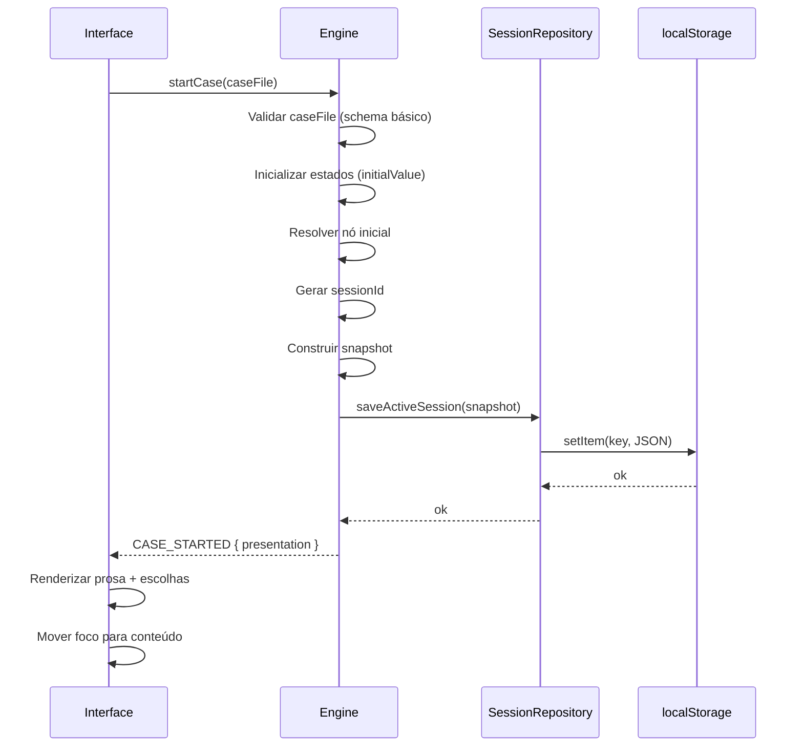

### Diagrama 4: Sequência — Confirmação Atômica de Escolha

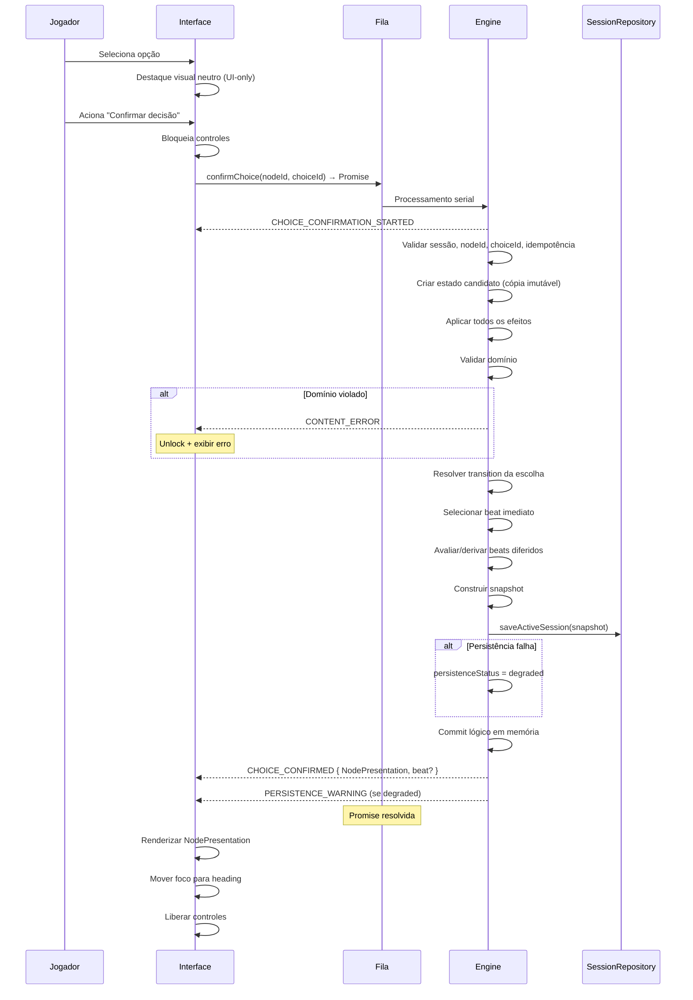

### Diagrama 5: Sequência — Falha de Persistência

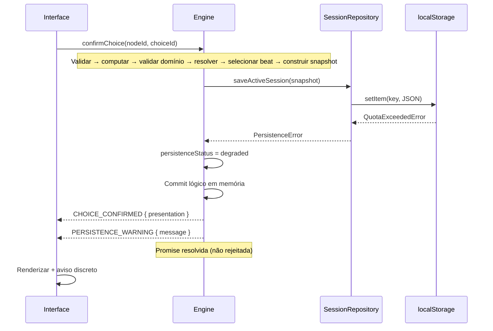

### Diagrama 6: Sequência — Restauração de Sessão

Substituído pelo Diagrama 15 (Application Bootstrap). Consulte o Diagrama 15 abaixo para o fluxo correto de restauração onde apenas o Application Bootstrap acessa o SessionRepository.

### Diagrama 7: Fluxograma — Resolução de Desfecho

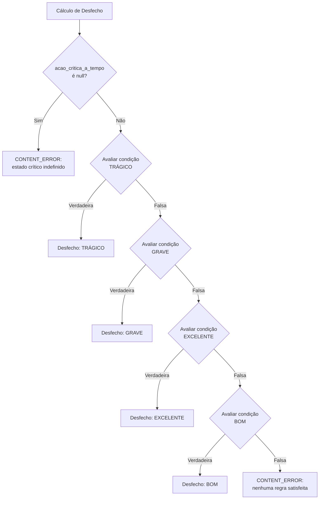

### Diagrama 8: Fluxograma — Validação de Conteúdo

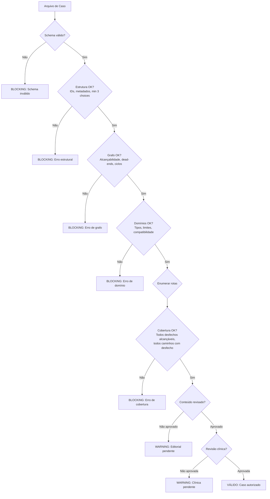

### Diagrama 9: Pipeline de Build e Deploy

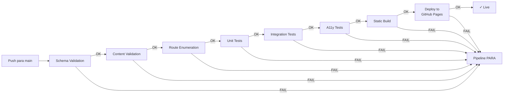

### Diagrama 10: Offline — Atualização e Incompatibilidade de Save

```mermaid
flowchart TD
    VISIT[Jogador acessa app] --> SW_CHECK{SW detecta<br/>nova versão?}
    SW_CHECK -->|Não| NORMAL[Operação normal offline]
    SW_CHECK -->|Sim| DL[Download novos assets<br/>em background]
    DL --> NOTIFY[Notificar jogador:<br/>"Nova versão disponível"]
    NOTIFY --> ACCEPT{Jogador aceita<br/>atualização?}
    ACCEPT -->|Não| LATER[Continua versão atual.<br/>Atualiza no próximo reload]
    ACCEPT -->|Sim| RELOAD[Reload com nova versão]
    RELOAD --> LOAD_CASE[Carregar case file novo]
    LOAD_CASE --> CHECK_SAVE{Save existente?}
    CHECK_SAVE -->|Não| NEW_SESSION[Tela inicial normal]
    CHECK_SAVE -->|Sim| VERSION_CHECK{caseVersion<br/>compatível?}
    VERSION_CHECK -->|Sim| OFFER_RESUME[Oferecer retomada]
    VERSION_CHECK -->|Não| DISCARD[Descartar save +<br/>mensagem ao jogador]
    DISCARD --> NEW_SESSION
```

### Diagrama 11: Histórico Progressivo

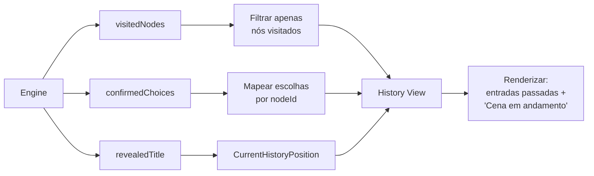

### Diagrama 12: Tema system/light/dark

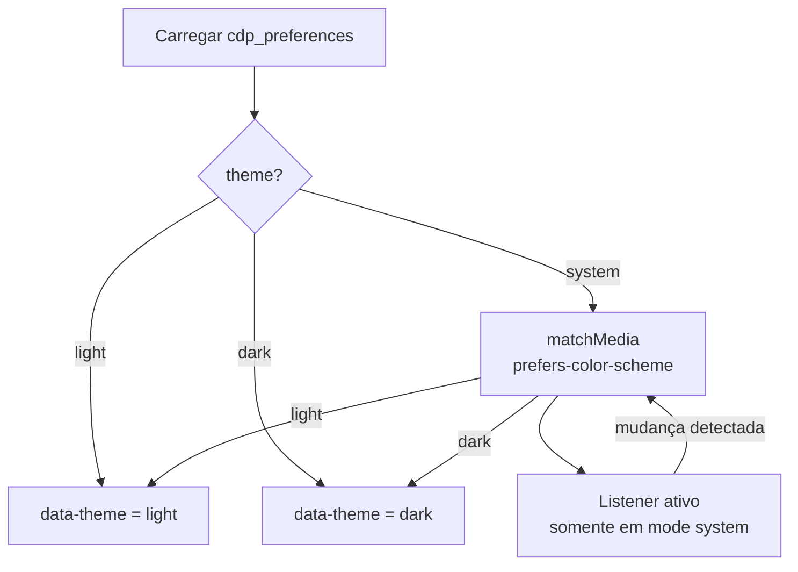

### Diagrama 13: Multiaba — Aviso sem Bloqueio

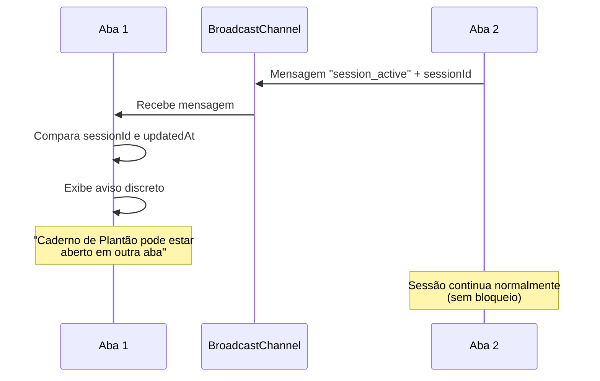

### Diagrama 14: Fluxo Final do Grafo (Resolução → Ending → Debriefing)

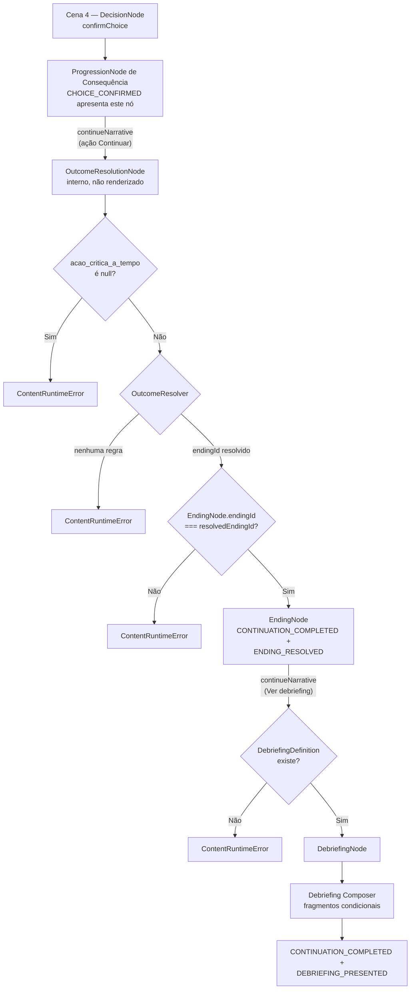

### Diagrama 15: Restauração de Sessão (Application Bootstrap)

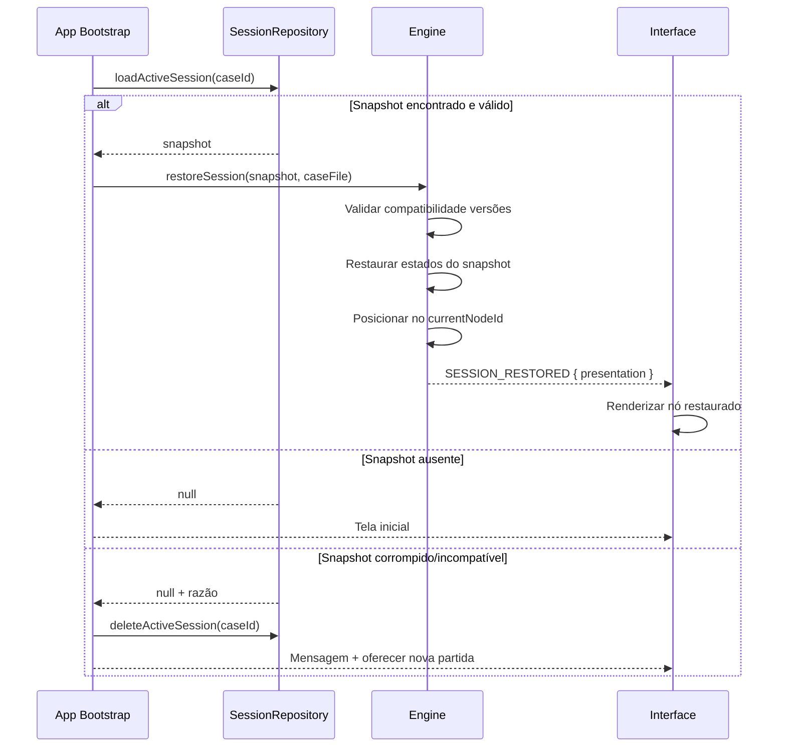

### Diagrama 16: Sequência — continueNarrative (3 variantes)

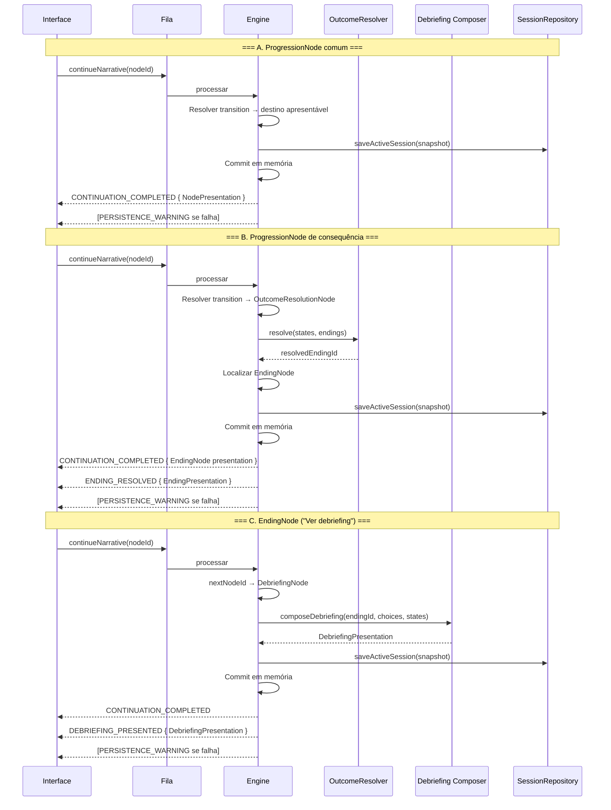

---

## 24. Decisões Técnicas e Alternativas

### ADR-01: Stack da Aplicação

- **Decisão**: TypeScript + Preact + Vite
- **Contexto**: MVP precisa ser leve, offline-capable, com tipagem forte para contratos
- **Alternativas consideradas**: React (pesado demais), Solid (menor comunidade), Vanilla TS (sem componentização)
- **Justificativa**: TypeScript garante type safety nos contratos Domain. Preact é leve (~3KB), API familiar (JSX), compatível com offline. Vite fornece build rápido e tree-shaking.
- **Consequências**: Curva de aprendizado mínima, bundle final pequeno
- **Riscos**: Comunidade menor que React
- **Mitigação**: Componentes são simples (texto + botões), baixa dependência de features avançadas

### ADR-02: Formato do Arquivo de Caso

- **Decisão**: JSON com schema JSON Schema para validação
- **Contexto**: Requisito RNF-4.1 exige formato legível, editável e versionável
- **Alternativas**: YAML (mais legível, parsing mais complexo), TOML (não suporta estruturas aninhadas bem), formato customizado
- **Justificativa**: JSON é nativo no browser (parse zero-cost), JSON Schema é padrão para validação, tooling abundante, diff legível em git
- **Consequências**: Verboso para humanos, mas editável com bom tooling (VS Code schema autocomplete)
- **Riscos**: Erros de sintaxe JSON são crípticos
- **Mitigação**: Validador com mensagens claras, possível editor visual futuro (fora do MVP)

### ADR-03: Biblioteca de Validação de Schema

- **Decisão**: Ajv (Another JSON Schema Validator) no tooling/build. Validador mínimo separado para saves em runtime.
- **Contexto**: Validação robusta de estrutura do caso antes da execução
- **Alternativas consideradas**: Zod (ergonômico mas duplicaria definições), io-ts, custom validator
- **Justificativa**: Ajv é o padrão de mercado para JSON Schema. Roda apenas em tooling/build — NÃO incluído no bundle de produção. Para validação defensiva de saves em runtime, um validador mínimo e específico é implementado separadamente (sem carregar Ajv completo).
- **Consequências**: Validação completa em build, validação leve em runtime
- **Riscos**: Dois mecanismos de validação (build vs runtime)
- **Mitigação**: Validador runtime apenas verifica campos obrigatórios e tipos do snapshot, não o schema completo do caso

### ADR-04: Gerenciamento de Estado da Engine

- **Decisão**: Estado imutável com cópia-na-escrita (copy-on-write)
- **Contexto**: Atomicidade da confirmação de escolha exige rollback fácil
- **Alternativas**: Estado mutável com undo log, event sourcing completo
- **Justificativa**: Copy-on-write é simples para grafos pequenos (6 estados). Rollback = descartar cópia. Event sourcing é overengineering para MVP.
- **Consequências**: Cada confirmação aloca uma cópia do mapa de estados (negligível para 6 estados)
- **Riscos**: Não escala para milhares de estados (irrelevante no MVP)
- **Mitigação**: Padrão pode evoluir para event sourcing em versões futuras se necessário

### ADR-05: Persistência

- **Decisão**: localStorage com serialização JSON
- **Contexto**: Requisito RNF-3.1 exige armazenamento local sem servidor
- **Alternativas**: IndexedDB (mais robusto, API assíncrona complexa), sessionStorage (não persiste entre sessões)
- **Justificativa**: localStorage é síncrono (simples), suficiente para o volume de dados do MVP (~2KB por save), universalmente suportado
- **Consequências**: Limite de ~5MB (mais que suficiente), API simples
- **Riscos**: Não disponível em navegação privada de alguns browsers
- **Mitigação**: Detecção de disponibilidade + modo sem salvamento (seção 14.8)

### ADR-06: Estratégia Offline

- **Decisão**: Service Worker com Workbox
- **Contexto**: Requisito RNF-2.2 exige operação offline após primeiro load
- **Alternativas**: App Cache (deprecated), sem offline (não atende requisito)
- **Justificativa**: Service Worker é o padrão moderno. Workbox simplifica precaching e estratégias de cache.
- **Consequências**: Complexidade adicional de lifecycle do SW
- **Riscos**: SW bugs podem causar cache eterna
- **Mitigação**: Versionamento de SW, skip-waiting com confirmação do usuário, assets com content hash

### ADR-07: Routing

- **Decisão**: Hash-based routing (sem library de routing)
- **Contexto**: GitHub Pages não suporta server-side fallback para SPAs
- **Alternativas**: History API + 404.html hack, routing library completa, URL única sem routing
- **Justificativa**: Hash routing garante reload seguro sem hacks. O MVP tem <10 "páginas" — não precisa de router sofisticado.
- **Consequências**: URLs com `#` (menos elegante, funcional)
- **Riscos**: Fragmentos de URL menos SEO-friendly (irrelevante para app interativa)
- **Mitigação**: N/A — funcionalidade priorizada sobre estética de URL

### ADR-08: Framework de Testes

- **Decisão**: Vitest + fast-check + Testing Library + axe-core
- **Contexto**: Necessidade de testes unitários, PBT, integração, UI e a11y
- **Alternativas**: Jest (mais lento, config mais complexa), Playwright (para E2E, futuro)
- **Justificativa**: Vitest é nativo Vite (zero config), fast-check para PBT, Testing Library para UI sem detalhes de implementação
- **Consequências**: Stack coesa com compartilhamento de config
- **Riscos**: Nenhum significativo para o escopo
- **Mitigação**: N/A

### ADR-09: Build Tool

- **Decisão**: Vite
- **Contexto**: Build rápido, dev server com HMR, tree-shaking, output otimizado
- **Alternativas**: Webpack (mais configurável, mais complexo), Parcel (zero-config mas menos controle), esbuild puro
- **Justificativa**: Vite é o padrão moderno para projetos TypeScript + SPA. Output otimizado para produção, plugin ecosystem, build instantâneo em dev.
- **Consequências**: Dev experience excelente, build de produção < 1s
- **Riscos**: Nenhum significativo
- **Mitigação**: N/A

### ADR-10: Deploy

- **Decisão**: GitHub Actions → GitHub Pages
- **Contexto**: Requisito de static hosting, projeto já no GitHub
- **Alternativas**: Netlify, Vercel, Cloudflare Pages
- **Justificativa**: GitHub Pages é gratuito, integrado ao repo, sem vendor lock-in para hosting. Pipeline no mesmo ecossistema.
- **Consequências**: Limitação de bandwidth (suficiente para MVP), sem server-side features (desejável)
- **Riscos**: Downtime do GitHub Pages (raro)
- **Mitigação**: Assets cacheados pelo SW garantem funcionamento offline mesmo com downtime

### ADR-11: Política de Erros

- **Decisão**: Fail-safe com preservação de estado + mensagem legível
- **Contexto**: Erros não devem destruir a experiência do jogador
- **Alternativas**: Fail-fast (crash), silencioso (esconder erros)
- **Justificativa**: Preservar estado permite recuperação. Mensagem legível informa sem expor internals. Fail-fast é aceitável apenas em validação de build.
- **Consequências**: Jogador quase nunca perde progresso por erro técnico
- **Riscos**: Estado corrompido em caso de bug não previsto
- **Mitigação**: Validação robusta + testes de propriedade + detecção de corrupção na restauração

### ADR-12: Temas e Preferências Visuais

- **Decisão**: CSS Custom Properties com `data-theme`, preferência salva em `cdp_preferences` separada da sessão
- **Contexto**: Referência visual canônica exige temas claro e escuro com mode system
- **Alternativas**: Biblioteca de temas (ex: theme-ui), CSS-in-JS
- **Justificativa**: CSS Custom Properties é nativo, sem dependência, performático, suporta media query. Separar de sessão evita misturar preferências visuais com dados narrativos.
- **Consequências**: Implementação leve, testável, sem impacto no bundle
- **Riscos**: Nenhum significativo
- **Mitigação**: N/A

### ADR-13: Histórico Progressivo e Não Preditivo

- **Decisão**: Histórico mostra apenas nós visitados e escolhas confirmadas; nunca revela futuro
- **Contexto**: Referência visual canônica proíbe spoilers, contagem total e cenas futuras
- **Alternativas**: Timeline completa com itens bloqueados, progresso percentual
- **Justificativa**: Preserva imersão narrativa, evita metagaming, alinha com filosofia do projeto (informação emerge da narrativa, não da interface)
- **Consequências**: Jogador não sabe quantas cenas restam
- **Riscos**: Possível confusão sobre "quanto falta" — mitigado pelo tom literário que naturalmente não revela duração
- **Mitigação**: N/A

### ADR-14: Referência Visual Canônica

- **Decisão**: `Referencia_visual_canonica.png` + `Referencia_visual_canonica.md` são a direção visual oficial
- **Contexto**: Necessário alinhar decisões de UI com uma referência aprovada
- **Alternativas**: Protótipo interativo (fora do escopo)
- **Justificativa**: Imagem + documento descritivo definem tom visual sem ambiguidade
- **Consequências**: Implementação tem referência clara para review visual
- **Riscos**: Imagem pode conter elementos que conflitem com requisitos — resolvido pela precedência (requirements.md > design.md > referência visual)
- **Mitigação**: Seção 20C.5 lista explicitamente o que NÃO copiar da imagem

### ADR-15: Multiaba com Aviso

- **Decisão**: Detecção via BroadcastChannel (fallback: storage event) + aviso. Sem lock exclusivo.
- **Contexto**: Múltiplas abas podem causar conflito de escrita no localStorage
- **Alternativas**: Web Lock API (suporte limitado), SharedWorker (complexidade), lock exclusivo
- **Justificativa**: MVP não precisa garantia absoluta de exclusividade. Aviso é suficiente para informar o jogador. Exclusividade robusta é complexa e fora do escopo.
- **Consequências**: Possível conflito se jogador ignorar aviso — risco baixo, impacto recuperável
- **Riscos**: Dados corrompidos em cenário extremo
- **Mitigação**: Validação defensiva ao restaurar; sessionId/updatedAt para identificar versão mais recente

### ADR-16: Gerenciamento de Estado da UI

- **Decisão**: Zustand como store reativo da camada de Interface, fazendo a ponte entre eventos da Engine e os componentes Preact.
- **Contexto**: A Engine emite eventos assíncronos (subscribe/Unsubscribe). A UI precisa de um estado derivado reativo que reflita o último evento relevante sem acoplar componentes diretamente à Engine.
- **Alternativas**: Signals nativos do Preact (granulares mas sem middleware/devtools), Context + useReducer (prop-drilling em árvores profundas), estado local por componente (fragmentação).
- **Justificativa**: Zustand oferece store centralizado leve (~1 kB), sem boilerplate, compatível com Preact (usa useSyncExternalStore). Isola a UI da mecânica interna da Engine — a UI lê do store, nunca modifica estados narrativos diretamente. O ADR-04 (copy-on-write) rege o estado da Engine; este ADR rege apenas a camada de apresentação.
- **Consequências**: Dependência adicional (~1 kB gzipped). Store é read-only para componentes (escrita apenas via handlers que chamam a API da Engine).
- **Riscos**: Overhead conceitual mínimo para projeto com poucos componentes.
- **Mitigação**: Store único e flat; sem normalização complexa. Pode ser substituído por signals se Preact evoluir nessa direção.

---

## 25. Riscos

| # | Risco | Probabilidade | Impacto | Mitigação |
|---|-------|--------------|---------|-----------|
| 1 | Prosa canônica incompleta (lacunas B.1, B.2, B.4, B.5) impede build de produção | Alta | Alto | Pipeline aceita content draft em dev. Produção exige `approved`. Placeholder marcados e rastreáveis. |
| 2 | Validação clínica (D.1, D.2) atrasa publicação | Alta | Médio | Seção de revisão clínica marcada como "sujeita a validação". Deploy de preview sem aprovação clínica. |
| 3 | localStorage indisponível em alguns contextos (incognito mode) | Média | Baixo | Modo sem salvamento funcional, mensagem clara |
| 4 | Service Worker com cache eterna após bug | Baixa | Alto | Versionamento estrito, skip-waiting, content hashes em assets |
| 5 | Incompatibilidade de save frustra jogadores após atualização | Média | Médio | Mensagem clara. MVP explicitamente não suporta migração. |
| 6 | Acessibilidade incompleta em browsers móveis antigos | Baixa | Médio | Suporte apenas 2 últimas versões estáveis. Degradação graciosa. |
| 7 | Grafo do Caso 01 tem path não previsto que bypassa Cena 4 | Muito Baixa | Alto | Validador enumera TODAS as rotas. Cena 4 sempre executada por design do grafo. |
| 8 | Performance de enumeração de rotas cresce exponencialmente com novos casos | Baixa (futuro) | Médio | Para MVP (4 decisões, ~108 rotas) é trivial. Otimizar em casos futuros se necessário. |
| 9 | Conflito multi-tab corrompe localStorage | Baixa | Médio | Detecção + aviso via BroadcastChannel; usa sessionId/updatedAt para resolver |
| 10 | Beat interpessoal ausente para alguma banda em algum nó | Média | Baixo | Validador detecta (critério 21). Em produção, build falha. |

---

## 26. Lacunas Abertas

### Lacunas Narrativas/Editoriais

| ID | Descrição | Impacto Técnico | Ponto no Fluxo | Bloqueia Dev? | Bloqueia Prod? | Placeholder/Contrato |
|----|-----------|-----------------|----------------|---------------|----------------|---------------------|
| B.1 | Prosa de Rotas_As_Balas.md não é texto final executável para todas as rotas | Nós narrativos sem prosa final | `nodes[].prose` | Não (usar fragmentos existentes) | Sim | Campo `prose` preenchido com texto disponível + flag `provisionalContent` |
| B.2 | Prosa dos desfechos resumida (1-2 frases) — requer expansão | Tela de ending com conteúdo mínimo | `endings[].prose` | Não | Sim | Usar frases existentes como placeholder |
| B.4 | Beats interpessoais sem prosa final para todas as cenas × 3 bandas | Beats sem conteúdo para exibir | `interpersonalBeats[].prose` | Não | Sim | Prosa provisória indicando tom da banda |
| B.5 | Prosa canônica dos fragmentos do debriefing não definida | Debriefing sem conteúdo executável | `debriefingFragments[].content` | Não | Sim | Fragmentos placeholder com seção e analysisCategory definidos |

### Lacunas Clínicas

| ID | Descrição | Impacto Técnico | Ponto no Fluxo | Bloqueia Dev? | Bloqueia Prod? | Placeholder/Contrato |
|----|-----------|-----------------|----------------|---------------|----------------|---------------------|
| D.1 | Debriefing sem validação por profissional qualificado | Conteúdo pode ser impreciso clinicamente | `debriefingFragments[].content` | Não | Sim | Aviso "sujeita a validação profissional" |
| D.2 | Consequências de escolhas sem validação de realismo clínico | Efeitos podem não refletir realidade | `choices[].effects` | Não | Sim | Efeitos baseados em LV_2.0 como baseline |

### Decisões Editoriais Pendentes

| # | Decisão | Status | Nota |
|---|---------|--------|------|
| E.1 | Formato do arquivo de caso | **RESOLVIDA** | JSON + JSON Schema + Ajv (tooling/build). Schema concreto produzido durante implementação. |
| E.2 | Migração de saves | **PÓS-MVP** | Save incompatível descartado com mensagem clara. |
| E.3 | Mecanismo offline | **RESOLVIDA** | vite-plugin-pwa + Workbox + Service Worker. Lista de precache definida no build. |

---

## 27. Checklist de Conformidade

### Matriz Design × Requisitos

| Requisito | Seção do Design | Status |
|-----------|----------------|--------|
| R1 — Modelo de Dados | §4, §5 | ✓ Coberto |
| R2 — Motor Narrativo | §7, §9, §10 | ✓ Coberto |
| R3 — Estados e Efeitos | §4.4, §6, §9 | ✓ Coberto |
| R4 — Transições Condicionais | §4.4, §6, §9 | ✓ Coberto |
| R5 — Seleção de Desfecho | §11 | ✓ Coberto |
| R6 — Debriefing | §13 | ✓ Coberto |
| R7 — Salvamento Local | §14 | ✓ Coberto |
| R8 — Retomada de Sessão | §14.6, §14.7 | ✓ Coberto |
| R9 — Interface Responsiva | §19, §20 | ✓ Coberto |
| R10 — Acessibilidade | §19 | ✓ Coberto |
| R11 — Validação Estrutural | §15 | ✓ Coberto |
| R12 — Execução Caso 01 | §5, §11, §12, §13 | ✓ Coberto |
| RNF-1 — Desempenho | §9 (algoritmo em 11 passos) | ✓ Coberto |
| RNF-2 — Compatibilidade | §17, §18 | ✓ Coberto |
| RNF-3 — Armazenamento | §14 | ✓ Coberto |
| RNF-4 — Manutenibilidade | §3, §5, §7 | ✓ Coberto |
| RNF-5 — Restrições MVP | §2, §7 | ✓ Coberto |

### Lista de Decisões de Design

1. ADR-01 a ADR-15 (seção 24)
2. Discriminated union para nós narrativos (§4.2)
3. Debriefing composto por fragmentos condicionais específicos por rota (§13.3)
4. Hash routing sem library (§17.2)
5. Enumeração exaustiva de rotas para MVP (§15.3)
6. Copy-on-write para atomicidade (§9, ADR-04)
7. Engine processa comandos sequencialmente (§9.2)

### Lista de Premissas

1. Prosa canônica será fornecida como entrada editorial (lacunas B.*)
2. Validação clínica será feita por profissional externo (lacunas D.*)
3. Grafo do Caso 01 tem ≤ 108 rotas (enumeração viável)
4. localStorage disponível na maioria dos contextos de uso
5. GitHub Pages oferece disponibilidade suficiente
6. MVP não requer migração de saves
7. Jogadores possuem browsers modernos (2 últimas versões estáveis)

### Lista de Riscos

(Detalhados na seção 25 — 10 riscos identificados)

### Pontos Requerendo Aprovação Humana

| # | Ponto | Responsável | Tipo |
|---|-------|-------------|------|
| 1 | Prosa final de todas as rotas narrativas | Editor | Editorial |
| 2 | Prosa expandida dos 4 desfechos | Editor | Editorial |
| 3 | Prosa dos beats interpessoais (4 cenas × 3 bandas) | Editor | Editorial |
| 4 | Texto completo do debriefing (6 seções × 4 desfechos) | Editor + Clínico | Editorial + Clínico |
| 5 | Validação de adequação clínica das consequências | Profissional de saúde | Clínico |
| 6 | Aprovação final do arquivo de caso para produção | Editor + Clínico + Dev | Multidisciplinar |

---

## Decisões e Conflitos Identificados

### Conflitos entre documentos canônicos

| # | Conflito | Documentos Envolvidos | Resolução Adotada |
|---|----------|----------------------|-------------------|
| 1 | LV_2.0 §8 declara Cena 4 "só ocorre se tempo_atrasado ≥ 1" vs requirements.md DC-1 "Cena 4 SEMPRE executada" | LV_2.0 vs requirements.md | requirements.md prevalece (Decisão Canônica 1). Cena 4 sempre executada. |
| 2 | LV_2.0 §3 usa `heparina_segura` vs requirements.md DC-12 renomeia para `processo_heparina_seguro` | LV_2.0 vs requirements.md | requirements.md prevalece (DC-12). Renomeação aplicada. |
| 3 | LV_2.0 §9 condições de desfecho diferem das condições em requirements.md (Trágico inclui `processo_heparina_seguro`) | LV_2.0 vs requirements.md | requirements.md prevalece. Condições de desfecho usam a versão do requirements.md que é mais detalhada. |
| 4 | LV_2.0 §9 não declara `acao_critica_a_tempo` como nullable vs requirements.md DC-2 | LV_2.0 vs requirements.md | requirements.md prevalece (DC-2). Estado é nullable boolean com initial null. |
| 5 | Bíblia v2 §6 não menciona nós de progressão explicitamente vs requirements.md glossário e DC-6 | Bíblia v2 vs requirements.md | requirements.md prevalece com diferenciação formal de nós. Bíblia v2 é mais genérica. |

### Decisões de design sem conflito explícito

| # | Decisão | Justificativa |
|---|---------|---------------|
| 1 | Debriefing composto por fragmentos condicionais | Dois jogadores com mesmo desfecho por caminhos diferentes recebem debriefings diferentes |
| 2 | Validação por enumeração exaustiva (não sampling) | Grafo pequeno no MVP permite verificação completa |
| 3 | Engine assíncrona com fila de comandos e subscribe | Persistence assíncrona, eventos desacoplados da chamada |
| 4 | Hash routing em vez de history API | Compatibilidade com GitHub Pages sem hacks |
| 5 | localStorage em vez de IndexedDB | Suficiente para o volume de dados, API mais simples |

---

## Correções Aplicadas — Passada 2

| # | Correção | Seções Alteradas | Decisão Final | Status |
|---|----------|-----------------|---------------|--------|
| 14 | Semântica HTML — botões nativos sem role="option" | §19.10 | `<button type="button">` sem ARIA redundante. Fluxo de confirmação em dois passos (selecionar + confirmar). | ✓ Aplicado |
| 15 | Foco no título com tabindex="-1" e aria-live curto | §19.3, §19.4 | Foco vai para heading. aria-live apenas para mensagens curtas. Prosa não anunciada por aria-live. Beats no fluxo normal. | ✓ Aplicado |
| 16 | Testes adicionais para mudanças estruturais e visuais | §22.8–22.16 | 10 novas categorias de teste cobrindo debriefing, engine async, transições, beats, histórico, temas, a11y, schema, multiaba. | ✓ Aplicado |
| 17 | Diagramas atualizados | §23 | Diagramas 11 (histórico), 12 (temas), 13 (multiaba) adicionados. Diagramas 3-10 já refletiam Passada 1. | ✓ Concluído |
| 18 | Busca textual por definições antigas | Todo o documento | Nenhuma ocorrência de: role="option", "Preact ou Solid", "Ajv ou Zod", increment negativo, debriefing genérico, defaultNextNodeId em uso, lock exclusivo multiaba, DebriefingDefinition inline, metadata duplicada. | ✓ Verificado |
| 19 | Tabela de correções | Fim do documento | Esta tabela. | ✓ Aplicado |
| G1.1 | CaseFile com campos editoriais formais | §4.1 | Campos warnings, editorialReferences, provisionalContent, editorialReviewStatus e clinicalReviewStatus incluídos no contrato. | ✓ Aplicado |
| G1.2 | Beats obrigatórios conforme ambiente | §12.3 | Draft=warning, prod build=blocking, runtime=ContentRuntimeError. Sem omissão silenciosa. | ✓ Aplicado |
| G1.3 | Enumerador de rotas atualizado | §15.3 | Processa OutcomeResolutionNode, EndingNode→DebriefingNode, transições autocontidas, composição de debriefing. | ✓ Aplicado |
| G1.4 | Matriz de conformidade — 11 passos | §27 | Referência ao algoritmo corrigida de "18 passos" para "11 passos". | ✓ Aplicado |
| G1.5 | Lacuna B.5 atualizada | §26 | Referência agora aponta para `debriefingFragments[].content`. | ✓ Aplicado |
| G3 | Histórico progressivo e não preditivo | §20A | Seção completa adicionada: princípio, estrutura, layout, contrato de apresentação. | ✓ Aplicado |
| G4 | Preferências visuais e temas | §20B | UserPreferences, ThemePreference, paletas claro/escuro, CSS Custom Properties, implementação sem lib externa. | ✓ Aplicado |
| G5 | Layout canônico | §20C | Referencia_visual_canonica.png/.md como referência oficial. Princípios, instrução de teclado, status de salvamento, lista de exclusões. | ✓ Aplicado |
| G7 | Correctness Properties 11–15 | Correctness Properties | Composição do debriefing, não predição do histórico, isolamento de preferências, sequencialidade de comandos, opacidade narrativa. | ✓ Aplicado |
| G9 | ADRs 12–15 | §24 | Temas, histórico progressivo, referência visual canônica, multiaba com aviso. | ✓ Aplicado |

---

## Declaração de Conclusão da Passada 2

**Verificações textuais confirmadas** — nenhuma definição antiga encontrada:
- ✓ Nenhum `role="option"`
- ✓ Nenhum aria-live com prosa integral
- ✓ Nenhum "Preact ou Solid"
- ✓ Nenhum "Ajv ou Zod"
- ✓ Nenhum retorno síncrono de EngineEvent em comando mutável
- ✓ Nenhum debriefing genérico por final
- ✓ Nenhum `defaultNextNodeId` em uso (apenas nota explicativa)
- ✓ Nenhum `choice.nextNodeId`
- ✓ Nenhum increment com amount negativo
- ✓ Nenhum beat silenciosamente opcional em produção
- ✓ Nenhum metadata duplicado
- ✓ Nenhum DebriefingDefinition inline no nó
- ✓ Nenhum lock exclusivo multiaba
- ✓ Nenhum "Cena X de Y" como feature (apenas como proibição)
- ✓ Nenhum conteúdo futuro no histórico
- ✓ Nenhuma preferência de tema dentro do snapshot narrativo

**Lacunas editoriais/clínicas que permanecem abertas:**
- B.1 — Prosa completa das rotas
- B.2 — Expansão dos 4 desfechos
- B.4 — Prosa dos beats interpessoais
- B.5 — Prosa dos fragmentos do debriefing
- D.1 — Validação clínica do debriefing
- D.2 — Validação clínica das consequências

**Pontos que exigem aprovação humana:**
1. Prosa final de todas as rotas (editor)
2. Prosa expandida dos 4 desfechos (editor)
3. Prosa dos beats interpessoais por faixa (editor)
4. Fragmentos condicionais do debriefing (editor + clínico)
5. Validação de adequação clínica (profissional de saúde)
6. Paletas de cor validadas por contraste (designer/dev)
7. Aprovação final do arquivo de caso para produção (multidisciplinar)

---

*Design.md revisado e completo. Passadas 1 e 2 concluídas. O documento está pronto para geração de tasks.md quando aprovado.*
